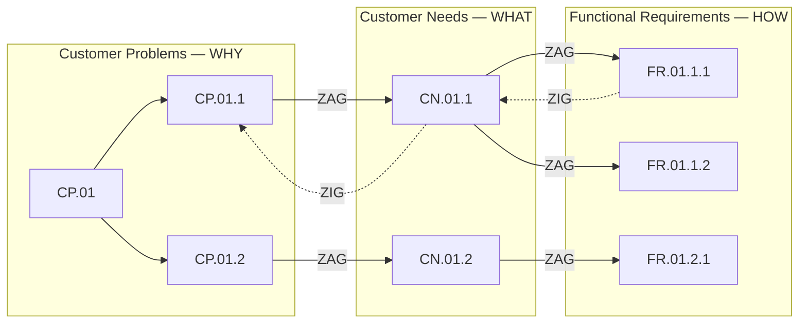

# Zig Zag Decomposition

> **Validation & Consistency Tool** for Problem-Based SRS methodology  
> **Purpose:** Map and decompose between CP, CN, and FR domains  
> **Single Responsibility:** Ensure traceability and consistency across domain hierarchies

> The key words "MUST", "MUST NOT", "REQUIRED", "SHALL", "SHALL NOT", "SHOULD", "SHOULD NOT", "RECOMMENDED", "NOT RECOMMENDED", "MAY", and "OPTIONAL" in this document are to be interpreted as described in BCP 14 [RFC 2119](https://www.rfc-editor.org/rfc/rfc2119) [RFC 8174](https://www.rfc-editor.org/rfc/rfc8174) when, and only when, they appear in all capitals, as shown here.

---

## Position in Process

This skill is used **during and after** Steps 1, 3, and 5 to validate and refine mappings between domains. It does not replace the generation skills—it complements them.

> **Diagram preference:** When visualizing traceability mappings, prefer Mermaid UML diagrams (e.g., `flowchart` for hierarchy trees, `graph` for dependency maps) over ASCII art where rendering supports it.



**Reading the diagram:** the top of each domain is decomposition level 1 and the nodes
below it are level 2 — the levels are the rows, not the ID scheme. Solid arrows ZAG
forward (problem → outcome → capability); dashed arrows ZIG back to validate that each
item still answers its source. Every ID names its own parent, so `FR.01.1.2` is traceable
to `CN.01.1` and on to `CP.01` without consulting the diagram at all.

---

## Axiomatic Design Adaptation

This skill adapts the **Zig Zag method** from Axiomatic Design (Suh, 1990) to Problem-Based SRS:

| Axiomatic Design | Problem-Based SRS | Mapping |
|------------------|-------------------|---------|
| Customer Domain  | Customer Problems (CP) | **WHY** - Why the solution is needed |
| Functional Domain | Customer Needs (CN) | **WHAT** - What the software provides |
| Physical Domain  | Functional Requirements (FR) | **HOW** - How the system behaves |

**Zigzagging Principle:** Decompose hierarchies by alternating between domains. Each level in one domain informs the decomposition in the next.

---

## Purpose

Validate and ensure consistency between CP, CN, and FR domains by:
1. Mapping artifacts across domains
2. Decomposing high-level items into sub-items
3. Identifying gaps, orphans, and inconsistencies

## Zig Zag Process

### ZAG (Left → Right): Mapping "What" to "How"
For each item in the left domain, identify corresponding items in the right domain:
- CP → CN: What outcomes does the software need to provide to address this problem?
- CN → FR: What system capabilities are required to deliver this outcome?

### ZIG (Right → Left): Validation "How" traces to "What"
For each item in the right domain, verify it traces back:
- FR → CN: Does this requirement deliver a needed outcome?
- CN → CP: Does this need address a real customer problem?

---

## Operations

### Operation 1: ZAG-MAP (Forward Mapping)
Map items from source domain to target domain.

Input: Source domain items (CP, CN, or FR)
Output: Mapping table showing relationships

Format:
| Source | Target(s) | Relationship | Gap? |
|--------|-----------|--------------|------|
| CP.01  | CN.01.1, CN.01.2 | CP.01 addressed by CN.01.1 (primary), CN.01.2 (secondary) | No |
| CP.02  | —          | No CN addresses CP.02 | YES |

### Operation 2: ZIG-VALIDATE (Backward Traceability)
Verify each item traces back to its source.

Input: Target domain items (CN or FR)
Output: Validation report

Format:
| Item | Traces To | Valid? | Issue |
|------|-----------|--------|-------|
| FR.01.1.1 | CN.01.1 | ✅     | —     |
| FR.07.1.1 | —         | ❌     | Orphan FR — its ID claims CN.07.1, which does not exist |

### Operation 3: DECOMPOSE (Hierarchical Breakdown)
Decompose a high-level item into sub-items, zigzagging between domains.

Process:
1. Start with high-level CP (e.g., CP.01)
2. ZAG → Identify CN(s) that address CP.01
3. ZIG → Review if CN decomposition suggests CP refinement
4. ZAG → For each CN, identify FR(s)
5. ZIG → Review if FR decomposition suggests CN refinement

Format:
```
CP.01: [High-level problem statement]
  ├── CN.01.1: [Outcome needed to address part of CP.01]
  │     ├── FR.01.1.1: [Capability for CN.01.1]
  │     └── FR.01.1.2: [Capability for CN.01.1]
  └── CN.01.2: [Another outcome for CP.01]
        └── FR.01.2.1: [Capability for CN.01.2]
```

### Operation 4: CONSISTENCY-CHECK (Full Audit)
Perform complete consistency analysis across all three domains.

Output:
- Coverage Matrix
- Gap Analysis
- Orphan Report
- Redundancy Detection

---

## Rules

### Independence Axiom
Each FR SHOULD ideally map to one CN. If an FR affects multiple CNs, flag for review—it may indicate a coupled design.

### Completeness Rule
- Every CP MUST have at least one CN
- Every CN MUST have at least one FR
- No orphan FRs (requirements without traced needs)
- No orphan CNs (needs without traced problems)

### Hierarchy Alignment
When decomposing, sub-items SHOULD align across domains — and the ID is what aligns them:
- a need addressing a facet of a problem repeats that problem's number: `CN.{cp}.{n}`
- a requirement repeats both its problem's and its need's: `FR.{cp}.{cn}.{n}`
- so `FR.01.2.3` can only sit under `CN.01.2`, which can only sit under `CP.01`

Write partial shapes with `{}` placeholders, the way the notation table does:
`FR.{cp}.{cn}.{n}` states which levels it stands for, whereas an ID cut short after two
levels names a requirement that cannot exist.

---

## Example: Zig Zag Decomposition

### Input
```
CP.01: Sales managers must know customer purchase history within 5 minutes
      otherwise losing sales opportunities during client calls.
```

### Zig Zag Process

**Step 1 - ZAG:** What outcome (CN) addresses this problem?
```
CN.01.1: The sales manager needs a CRM system to know the complete purchase 
      history of each customer at any time.
```

**Step 2 - ZIG:** Does CN.01.1 fully address CP.01? 
- CP.01 specifies "within 5 minutes" → CN.01.1 says "at any time" ✅
- CP.01 specifies "during client calls" → Consider decomposition

**Step 3 - DECOMPOSE CN:** the single outcome splits into two needs of the same problem,
so both keep `CP.01` as their first segment and number on from there:
```
CN.01.1: Sales manager needs CRM to display purchase history instantly.
CN.01.2: Sales manager needs CRM accessible during phone calls (mobile/desktop).
```

**Step 4 - ZAG:** What FRs deliver these CNs?
```
FR.01.1.1: The CRM shall display customer purchase history within 3 seconds.
FR.01.1.2: The CRM shall allow search by customer name or phone number.
FR.01.2.1: The CRM shall be accessible via mobile application.
FR.01.2.2: The CRM shall provide one-click access from phone integration.
```

**Step 5 - ZIG:** Validate FRs trace to CNs
| FR | CN | Valid |
|----|-----|-------|
| FR.01.1.1 | CN.01.1 | ✅ |
| FR.01.1.2 | CN.01.1 | ✅ |
| FR.01.2.1 | CN.01.2 | ✅ |
| FR.01.2.2 | CN.01.2 | ✅ |

This table is verifiable without reading a word of the statements: an `FR.{cp}.{cn}.{n}`
is valid exactly when a `CN.{cp}.{cn}` exists. That check is only possible because the ID
carries the parent.

### Final Hierarchy
```
CP.01: Sales managers must know customer purchase history within 5 minutes
  ├── CN.01.1: Display purchase history instantly
  │     ├── FR.01.1.1: Display within 3 seconds
  │     └── FR.01.1.2: Search by name/phone
  └── CN.01.2: Accessible during phone calls
        ├── FR.01.2.1: Mobile application
        └── FR.01.2.2: Phone integration
```

---

## Output Templates

### Coverage Matrix with Completeness Levels

Use **C** (Complete) and **P** (Partial) markers to indicate how well each element addresses its source:

```markdown
## CP → CN Coverage Matrix

|       | CN.01.1 | CN.02.1 | CN.02.2 | CN.03.1 |
|-------|---------|---------|---------|---------|
| CP.01 | C       |         |         |         |
| CP.02 |         | C       | P       |         |
| CP.03 |         |         |         | C       |

**Legend:**
- **C** = Complete — CN fully addresses the CP
- **P** = Partial — CN helps but doesn't fully solve the CP
- (blank) = No relationship

**Coverage Summary:**
- CP.01: Fully covered by CN.01.1 ✅
- CP.02: Covered by CN.02.1 (complete) + CN.02.2 (partial) ✅
- CP.03: Fully covered by CN.03.1 ✅
```

### Gap Analysis

```markdown
## Gap Analysis Report

### Uncovered Customer Problems
| CP | Statement | Suggested Action |
|----|-----------|------------------|
| CP.03 | [statement] | Generate CN using /problem-based-srs needs |

### Orphan Items
| Item | Type | Issue | Suggested Action |
|------|------|-------|------------------|
| FR.07.1.1 | FR | No CN traces — CN.07.1 does not exist | Remove or identify missing CN |
| CN.05.1 | CN | No CP traces — CP.05 does not exist | Validate business need or remove |

### Redundancies
| Items | Overlap | Suggested Action |
|-------|---------|------------------|
| FR.01.1.2, FR.02.1.1 | Both handle user search | Merge or differentiate scope |
```

---

## When to Use This Skill

| Situation | Operation | Input |
|-----------|-----------|-------|
| After CP generation | ZAG-MAP | CPs → verify CN coverage planned |
| After CN generation | ZIG-VALIDATE | CNs → verify all trace to CPs |
| After FR generation | CONSISTENCY-CHECK | All domains → full audit |
| Refining requirements | DECOMPOSE | Specific CP or CN to break down |

---

## Quality Checklist

Before completing zig zag analysis:

- [ ] Every CP has at least one CN mapped
- [ ] Every CN has at least one FR mapped
- [ ] Every FR traces back to a CN
- [ ] Every CN traces back to a CP
- [ ] Hierarchical IDs align (`CP.{n}` → `CN.{cp}.{n}` → `FR.{cp}.{cn}.{n}`)
- [ ] No orphan requirements identified
- [ ] Gaps documented with action items

---

## References

- **Axiomatic Design:** Suh, N.P. (1990). *The Principles of Design*. Oxford University Press.
- **Problem-Based SRS:** Gorski & Stadzisz (2016)

---

**Version:** 1.2  
**Type:** Validation & Consistency Tool  
**Domains:** CP ↔ CN ↔ FR
