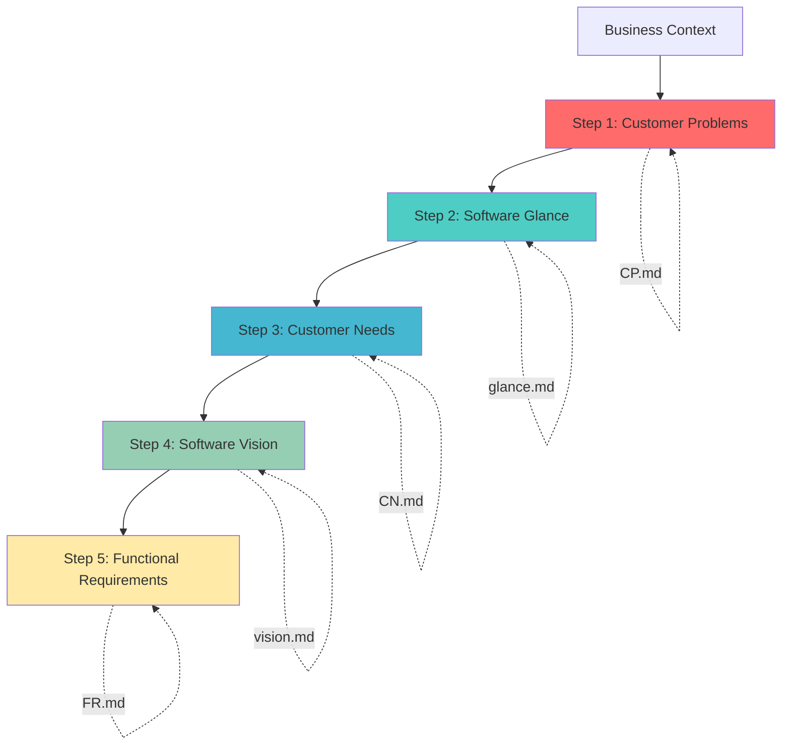
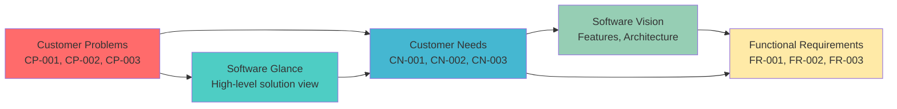
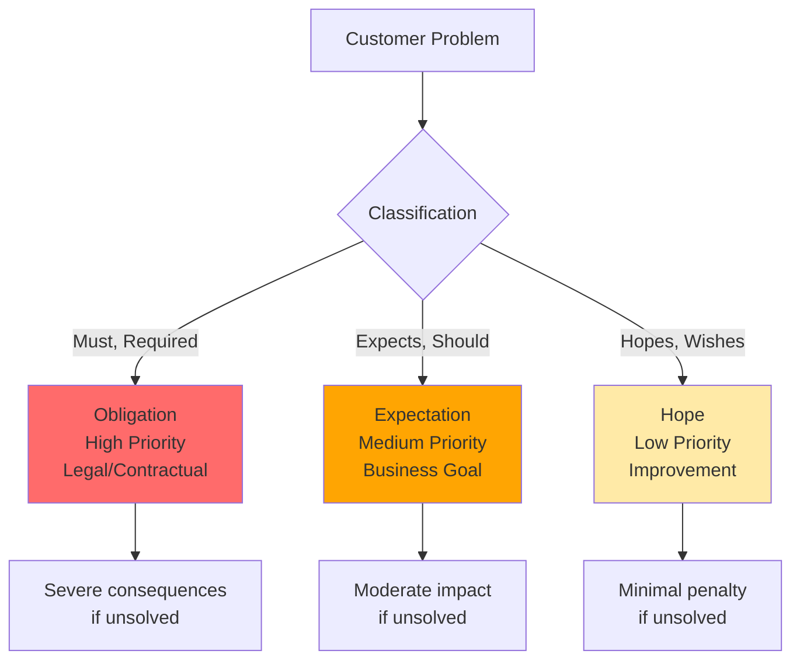
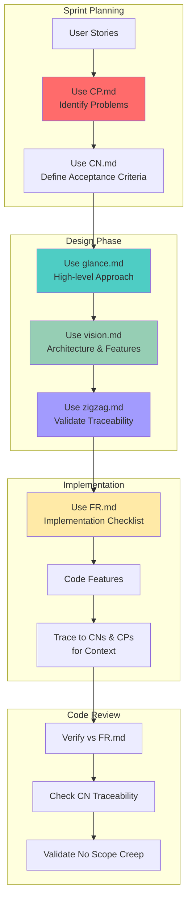

# Problem-Based SRS

A lightweight, prompt-first repository that provides **standalone prompts** and guidance for following a **Problem-Based Software Requirements Specification (SRS)** methodology. Designed for integration with AI agents like **GitHub Copilot** and **Claude Code**.

## 📄 Background

This repository is a **continuation of the work** presented in the research paper:

**"Problem-Based SRS: A Novel Approach for Software Requirements Specification"**  
by **Gorski and Stadzisz**

The paper presents a novel approach to improving software requirements specification quality by constructing knowledge about software requirements from knowledge about customer problems. The Problem-Based SRS methodology consists of an organization of activities and outcome objects through a process with five main steps, aiming to systematically analyze business context and specify software requirements while considering solution design.

The key insight from the research: **accurately capturing business intents of stakeholders remains a major challenge and factor in software project failures**. This methodology addresses this by ensuring requirements provide suitable answers to real customer business issues.

## 🎯 Purpose

Enable software engineers and requirements analysts to leverage AI agents for better requirements engineering by providing:

- **Structured prompts** for each phase of requirements gathering
- **Problem-first methodology** that ensures requirements solve real needs
- **AI agent integration** guides for GitHub Copilot and Claude Code
- **Lightweight approach** with no heavy tooling or frameworks
- **Examples and templates** for immediate use

## 📁 Repository Structure

```
prompts/
├── problem-based-SRS.md  # Coordinator prompt (start here)
├── CP.md                 # Step 1: Customer Problems
├── glance.md             # Step 2: Software Glance
├── CN.md                 # Step 3: Customer Needs
├── vision.md             # Step 4: Software Vision
├── FR.md                 # Step 5: Functional Requirements
└── zigzag.md             # Quality validation tool
```

## 📊 Methodology Overview

### The 5-Step Process



### Artifact Traceability

Each artifact traces back to ensure requirements solve real problems:



### Problem Classification

Customer Problems are classified by severity:



### Development Workflow Integration



## 🚀 Quick Start for Engineers

### For New Features

When starting a new feature, follow the 5-step process:

1. **Identify Problems** → Use `prompts/CP.md`
   ```
   @workspace Using prompts/CP.md, identify customer problems for [feature name]
   
   Business Context: [describe current situation]
   ```

2. **Design Solution Glance** → Use `prompts/glance.md`
   ```
   @workspace Using prompts/glance.md, create a software glance
   
   Input: [your CPs from step 1]
   ```

3. **Specify Needs** → Use `prompts/CN.md`
   ```
   @workspace Using prompts/CN.md, specify customer needs
   
   Input: [CPs and Software Glance]
   ```

4. **Define Vision** → Use `prompts/vision.md`
   ```
   @workspace Using prompts/vision.md, create software vision
   
   Input: [CPs, Glance, CNs]
   ```

5. **Generate Requirements** → Use `prompts/FR.md`
   ```
   @workspace Using prompts/FR.md, generate functional requirements
   
   Input: [all previous artifacts]
   ```

### Starting from Scratch

If you're new to a project or have only a business idea:

```
@workspace Use prompts/problem-based-SRS.md to guide me through requirements
```

The coordinator prompt will route you through the appropriate steps based on what you have.

### Validating Existing Requirements

To check consistency between artifacts:

```
@workspace Using prompts/zigzag.md, validate traceability between my CPs, CNs, and Requirements
```

## 💡 Usage Patterns

### Pattern 1: Full Feature Development
**When:** Building a new feature from business need  
**Start with:** `problem-based-SRS.md` (coordinator)  
**Follow:** All 5 steps sequentially

### Pattern 2: Requirements Refinement
**When:** You have draft requirements that need structure  
**Start with:** `FR.md` in review mode  
**Then:** Work backwards to validate against CNs and CPs

### Pattern 3: Problem Discovery
**When:** Stakeholders describe solutions, not problems  
**Start with:** `CP.md` in generation mode  
**Use discovery questions** to elicit actual problems

### Pattern 4: Quality Gate
**When:** Validating completeness before implementation  
**Start with:** `zigzag.md`  
**Verify:** All CPs are addressed, all CNs trace to CPs, all Requirements trace to CNs

## 🔧 Integration with Development Workflow

### During Sprint Planning
1. Use `CP.md` to capture user stories as customer problems
2. Use `CN.md` to define acceptance criteria as customer needs
3. Use `FR.md` to break down into technical requirements

### During Feature Design
1. Reference `glance.md` for high-level solution approach
2. Reference `vision.md` for architectural decisions and constraints
3. Use `zigzag.md` to ensure design addresses all needs

### During Implementation
1. Keep `FR.md` requirements as your implementation checklist
2. Trace each requirement back to its CN and CP for context
3. Update requirements if new problems are discovered

### During Code Review
1. Verify implementation satisfies requirements from `FR.md`
2. Check that requirements still trace to customer needs
3. Validate no scope creep beyond identified problems

## 📚 Additional Resources

- **Full Methodology:** See `docs/` for detailed research paper
- **Process Guide:** See `prompts/problem-based-SRS.md` for step-by-step coordination
- **Examples:** Each prompt file contains real-world examples
