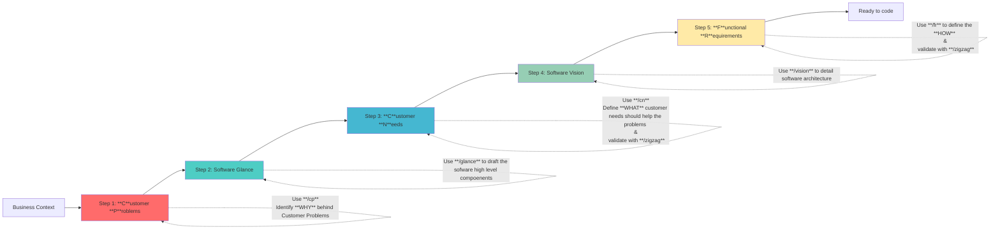
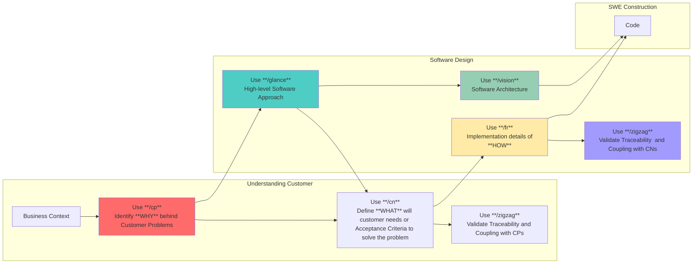
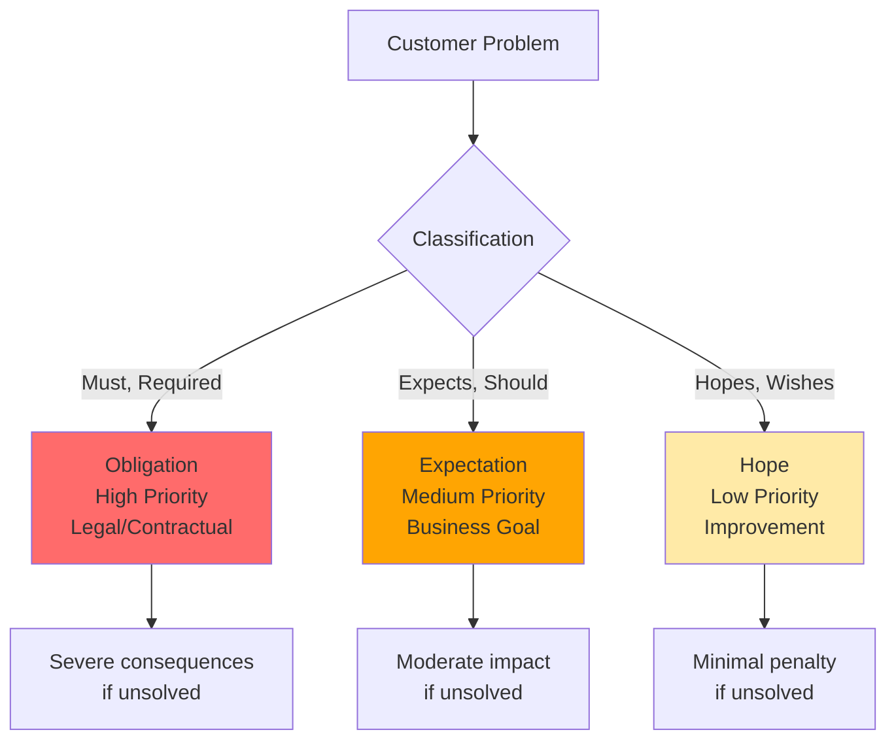
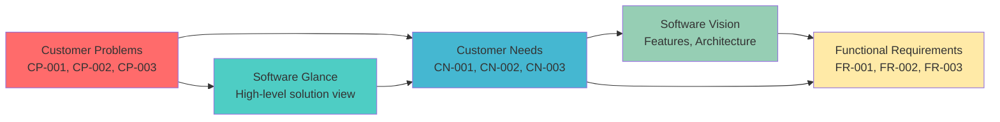

# Problem-Based SRS

[](https://github.com/agentskills/agentskills)
[](https://opensource.org/licenses/MIT)

An [Agent Skill](https://github.com/agentskills/agentskills) to use **Problem-Based Software Requirements Specification (SRS)** method in your software project. Designed for integration with AI agents like **GitHub Copilot** and **Claude Code**.

## 📄 Background

This repository is a **continuation of the work** presented in the research paper: **"Problem-Based SRS: A Novel Approach for Software Requirements Specification"** by **Gorski and Stadzisz**

This is a novel approach to improving software requirements specification quality by constructing knowledge about software requirements from knowledge about customer problems. 
The Problem-Based SRS methodology consists of an organization of activities and outcome objects through a process with five main steps, aiming to systematically analyze business context and specify software requirements while considering solution design.

The key insight from the research: **accurately capturing business intents of stakeholders remains a major challenge and factor in software project failures**. 
This methodology addresses this by ensuring requirements provide suitable answers to real customer business issues.

> **Supported Formats:** This repository provides [GitHub Copilot prompt files](https://docs.github.com/en/copilot/tutorials/customization-library/prompt-files) (`.github/prompts/`) and [AgentSkills](https://agentskills.io) (`skills/`) for maximum compatibility with AI coding assistants.

## 🎯 Purpose

Enable software engineers and requirements analysts to leverage AI agents for better requirements engineering by providing:

- **Structured Skills** for each phase of requirements gathering
- **Problem-first methodology** that ensures requirements solve real needs
- **AI agent integration** compatible with Claude Code, Claude.ai, and Claude API
- **Lightweight approach** with no heavy tooling or frameworks
- **Examples and templates** for immediate use


## 📁 Repository Structure

This repository supports multiple formats:
- **`.github/prompts/`** - [GitHub Copilot prompt files](https://docs.github.com/en/copilot/tutorials/customization-library/prompt-files) for VS Code, Visual Studio, and JetBrains IDEs
- **`skills/`** - [AgentSkills](https://agentskills.io) format for Claude Code and Claude.ai
```
.github/prompts/            # GitHub Copilot prompt files (VS Code, Visual Studio, JetBrains)
├── srs-coordinator.prompt.md  # Main orchestrator prompt
├── cp.prompt.md               # Step 1: Customer Problems
├── glance.prompt.md           # Step 2: Software Glance
├── cn.prompt.md               # Step 3: Customer Needs
├── vision.prompt.md           # Step 4: Software Vision
├── fr.prompt.md               # Step 5: Functional Requirements
└── zigzag.prompt.md           # Quality validation tool

skills/problem-based-srs/   # AgentSkills format (Claude Code, Claude.ai)
├── SKILL.md                # Main orchestrator skill
└── references/             # Detailed instructions for each step
    ├── step1-customer-problems.md
    ├── step2-software-glance.md
    ├── step3-customer-needs.md
    ├── step4-software-vision.md
    ├── step5-functional-requirements.md
    └── zigzag-validator.md
```

This repository supports two formats:
- **`.github/prompts/`** - [GitHub Copilot prompt files](https://docs.github.com/en/copilot/tutorials/customization-library/prompt-files) for VS Code, Visual Studio, and JetBrains IDEs
- **`skills/`** - [AgentSkills](https://agentskills.io) format for Claude Code and Claude.ai


## 📊 Methodology Overview

### The 5-Step Process




### Development Workflow Integration



## 🚀 Quick Start for Engineers

### Using GitHub Copilot Prompt Files (Recommended)

The prompts are available as `.prompt.md` files in `.github/prompts/`. In VS Code, Visual Studio, or JetBrains IDEs:

```
/cp           # Start with Customer Problems
/glance       # Create Software Glance
/cn           # Generate Customer Needs
/vision       # Build Software Vision
/fr           # Specify Functional Requirements
/zigzag       # Validate traceability
/srs-coordinator  # Full methodology orchestration
```

### Using with Any AI Agent (Universal)

The methodology works with any LLM (ChatGPT, DeepSeek, Claude, Llama, etc.). 

**Option 1: AgentSkills (Open Standard)**
The `skills/` directory follows the [AgentSkills standard](https://agentskills.io), compatible with any tool that implements it.

**For Claude Code:**
The skill will auto-discover when this repository is in your workspace.

**For Claude.ai:**
Upload the skill from `skills/problem-based-srs/` (including the references folder).

### For New Features

Simply describe your business context or problem:

```
I need to create requirements for [feature name]

Business Context: [describe current situation]
```

The skill will automatically:
1. Detect what step you're on
2. Load the appropriate reference guide
3. Walk you through the process
4. Ensure traceability back to business problems

### Specific Step Examples

**Start with Customer Problems:**
```
Help me identify customer problems for my inventory management system
```

#### Problem Classification

Customer Problems are classified by severity:




**Create Software Glance:**
```
I have customer problems documented, need to create a software glance
```

**Validate Traceability:**
```
Check if my requirements properly trace back to customer problems
```

Artifact Traceability: Each artifact traces back to ensure requirements solve real problems:




## 💡 Usage Patterns

### Pattern 1: Full Feature Development
**When:** Building a new feature from business need  
**Start with:** `/srs-coordinator` prompt  
**Follow:** All 5 steps sequentially

### Pattern 2: Requirements Refinement
**When:** You have draft requirements that need structure  
**Start with:** `/fr` in review mode  
**Then:** Work backwards to validate against CNs and CPs

### Pattern 3: Problem Discovery
**When:** Stakeholders describe solutions, not problems  
**Start with:** `/cp` in generation mode  
**Use discovery questions** to elicit actual problems

### Pattern 4: Quality Gate
**When:** Validating completeness before implementation  
**Start with:** `/zigzag`  
**Verify:** All CPs are addressed, all CNs trace to CPs, all Requirements trace to CNs

## 🔧 Integration with Development Workflow

### During Sprint Planning
1. Use `/cp` to capture user stories as customer problems
2. Use `/cn` to define acceptance criteria as customer needs
3. Use `/fr` to break down into technical requirements

### During Feature Design
1. Reference `/glance` for high-level solution approach
2. Reference `/vision` for architectural decisions and constraints
3. Use `/zigzag` to ensure design addresses all needs

### During Implementation
1. Keep `/fr` requirements as your implementation checklist
2. Trace each requirement back to its CN and CP for context
3. Update requirements if new problems are discovered

### During Code Review
1. Verify implementation satisfies requirements from `/fr`
2. Check that requirements still trace to customer needs
3. Validate no scope creep beyond identified problems

## 📚 Additional Resources

- **Full Methodology:** See `docs/` for detailed research paper
- **GitHub Copilot Prompts:** See `.github/prompts/` for prompt files
- **AgentSkills:** See `skills/problem-based-srs/` for Claude Code integration
- **Examples:** Each prompt file contains real-world examples
