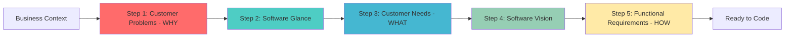

# Problem-Based SRS

[](https://github.com/RafaelGorski/Problem-Based-SRS/releases/tag/v1.0)
[](https://github.com/agentskills/agentskills)
[](https://opensource.org/licenses/MIT)

An [Agent Skill](https://github.com/agentskills/agentskills) to use **Problem-Based Software Requirements Specification (SRS)** method in your software project. Designed for integration with AI agents like GitHub Copilot, Claude, and others.

## 📄 Background

This repository continues the work from the research paper **"Problem-Based SRS: A Novel Approach for Software Requirements Specification"** by Gorski and Stadzisz.

The methodology helps create better software requirements by starting with customer problems instead of jumping to solutions. It uses a structured 5-step process to analyze business needs and ensure requirements actually solve real customer problems.

**Why this matters:** Many software projects fail because teams don't accurately capture what stakeholders really need. This methodology fixes that by connecting every requirement back to a specific business problem.

> This repository uses the [AgentSkills](https://agentskills.io) format, making it compatible with GitHub Copilot, Claude, and other AI agents.

## 🚀 Quick Start

Ask your AI agent to install and use this skill:

**GitHub Copilot:**
```
Install the Problem-Based SRS skill from RafaelGorski/Problem-Based-SRS
```

**Claude:**
```
Install the AgentSkill from https://github.com/RafaelGorski/Problem-Based-SRS
```

Then start with:
```
/problem-based-srs
```

The AI will guide you through the 5-step process automatically.

## 💡 Available Commands

| Command | Description |
|---------|-------------|
| `/problem-based-srs` | Start the full guided methodology |
| `/cp` | Step 1: Identify Customer Problems (the WHY) |
| `/glance` | Step 2: Create Software Glance (high-level view) |
| `/cn` | Step 3: Define Customer Needs (the WHAT) |
| `/vision` | Step 4: Document Software Vision (architecture) |
| `/fr` | Step 5: Specify Functional Requirements (the HOW) |
| `/zigzag` | Validate traceability between artifacts |

## 📊 Methodology Overview

### The 5-Step Process



Each step builds on the previous one, ensuring all requirements trace back to real business problems.

## 🛠️ Installation

### Option 1: Let Your AI Agent Install It (Easiest)

Just ask your AI agent:
```
Install the Problem-Based SRS skill from RafaelGorski/Problem-Based-SRS
```

### Option 2: Manual Installation

Clone the repository and copy to your skills directory:

```bash
# Clone
git clone https://github.com/RafaelGorski/Problem-Based-SRS.git

# Copy to your AI agent's skills directory
# For Claude Code
cp -r Problem-Based-SRS/skills/problem-based-srs ~/.claude/skills/

# For GitHub Copilot
cp -r Problem-Based-SRS/skills/problem-based-srs ~/.copilot/skills/
```

**Skills directories by agent:**

| Agent | macOS/Linux | Windows |
|-------|-------------|---------|
| Claude Code | `~/.claude/skills/` | `%USERPROFILE%\.claude\skills\` |
| GitHub Copilot | `~/.copilot/skills/` | `%USERPROFILE%\.copilot\skills\` |
| Gemini CLI | `~/.gemini/skills/` | `%USERPROFILE%\.gemini\skills\` |
| Cline | `~/.cline/skills/` | `%USERPROFILE%\.cline\skills\` |
| Goose | `~/.config/goose/skills/` | `%USERPROFILE%\.config\goose\skills\` |


## 💡 Usage Examples

### Basic Workflow

1. **Start a conversation:**
```
I need requirements for an inventory management system. Our warehouse
tracks everything in spreadsheets and loses $50k/month due to errors.
```

2. **The AI will guide you through:**
   - Identifying Customer Problems (the WHY)
   - Creating Software Glance (high-level view)
   - Defining Customer Needs (the WHAT)
   - Building Software Vision (architecture)
   - Specifying Functional Requirements (the HOW)
   - Validating traceability with `/zigzag`

### Common Use Cases

**New Project:** Use `/problem-based-srs` to go through all 5 steps sequentially.

**Refining Existing Requirements:** Use `/fr` to review and validate your current requirements.

**Finding Root Problems:** Use `/cp` when stakeholders describe solutions instead of problems.

**Quality Check:** Use `/zigzag` to verify all requirements trace back to real business problems.

## 🧪 Testing

This repository includes comprehensive tests to ensure quality.

**Test Coverage:** 57 of 58 tests passing (98.3%)

```bash
# Install dependencies
pip install pytest strictyaml

# Run all tests
pytest tests/ -v
```

See [TESTING.md](TESTING.md) for detailed testing documentation.

## 📚 Additional Resources

- **[TESTING.md](TESTING.md)** - Testing documentation
- **[CHANGELOG.md](CHANGELOG.md)** - Version history
- **docs/** - Research paper and methodology details
- **skills/problem-based-srs/** - AgentSkills format for AI agents
- **spec/** - Test specifications and requirements

## 📋 Version 1.0 (February 2026)

First stable release featuring:

- AgentSkills format compatible with GitHub Copilot, Claude, and other AI agents
- Complete 5-step methodology with traceability validation
- 57+ tests for quality assurance
- Comprehensive documentation and examples
