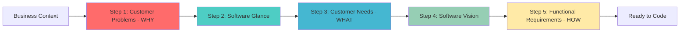
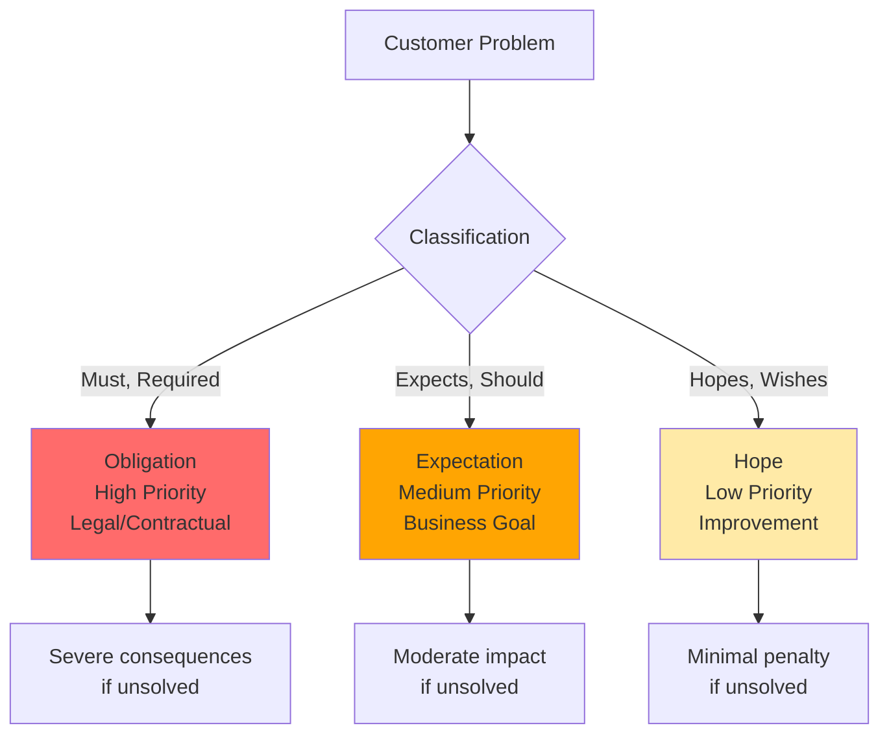

# Problem-Based SRS

[](https://github.com/RafaelGorski/Problem-Based-SRS/releases/tag/v1.0)
[](https://github.com/agentskills/agentskills)
[](https://opensource.org/licenses/MIT)

**Stop building the wrong thing.** If you've ever spent weeks building a feature only to discover it didn't solve the actual problem—or worse, solved the wrong problem—this methodology is for you.

Let your AI agent guide you through proven requirements engineering that starts with **real customer problems**, not feature wish lists. Works with GitHub Copilot, Claude, and other AI coding assistants to help you create software requirements that actually solve business problems and maximize the impact of your work.

## ⚡ What You'll Get

This methodology helps engineers:

- ✅ **Discover real problems** - Identify what customers actually need before writing any code
- ✅ **Align your work with business impact** - Every line of code traces back to a problem it solves
- ✅ **Avoid wasted effort** - Stop building "nice-to-have" features disguised as critical requirements
- ✅ **Ship with confidence** - Know exactly why each feature matters and to whom
- ✅ **Reduce rework** - Catch misunderstandings early, before weeks of coding are invested
- ✅ **AI-guided process** - Your coding assistant walks you through each step automatically

**Based on peer-reviewed research** by Gorski & Stadzisz, this approach systematically addresses the #1 cause of software project failures: building what stakeholders *asked for* instead of what they actually *need*.

## 💰 Why Engineers Love This

**Before Problem-Based SRS:**
- Stakeholder: "We need a reporting dashboard with 20 charts."
- You: Build it over 3 weeks.
- Result: They only use 3 charts. The real problem was slow data access, not visualization.

**With Problem-Based SRS:**
- Step 1: Discover the actual problem → "Managers must access sales data within 5 seconds to make decisions."
- Step 2: Design solution → Simple data API + 3 key charts.
- Result: Built in 1 week. Solves the real problem. Stakeholders happy.

**ROI:** Spend 30 minutes upfront with your AI agent to save weeks of building the wrong thing.

## 🎯 See It In Action

Here's what happens when you use this methodology:

**Your input:**
```
I need requirements for an inventory management system. Our warehouse
tracks everything in spreadsheets and loses $50k/month due to errors.
```

**The AI guides you through:**

1. **Customer Problems (WHY)**
   - CP.01: "Warehouse must track inventory accurately otherwise $50k/month lost to errors"
   - CP.02: "Staff expects real-time inventory visibility otherwise delays in fulfillment"

2. **Software Glance**
   - "Web-based inventory system with barcode scanning and real-time sync"

3. **Customer Needs (WHAT)**
   - CN.01.1: "Warehouse needs system to track inventory with 99.9% accuracy"
   - CN.02.1: "Staff needs system to scan items and update inventory within 2 seconds"

4. **Software Vision**
   - "Cloud inventory platform with mobile scanning app for 50 concurrent users"

5. **Functional Requirements (HOW)**
   - FR.01.1.1: "System shall maintain 99.9% accuracy in inventory counts"
   - FR.02.1.1: "System shall scan barcodes and update inventory database within 2 seconds"

**Result:** Every requirement traces back to the $50k problem. You build only what solves the actual business need. No wasted features.

## 👥 Who Should Use This

**Perfect for:**
- **Software Engineers** building features from vague stakeholder requests
- **Tech Leads** ensuring team builds the right thing
- **Product Engineers** validating ideas before sprint planning
- **Solution Architects** aligning technical design with business problems
- **Anyone using AI coding assistants** who wants better requirements

**Use it when:**
- Starting a new feature or project
- Stakeholders describe solutions instead of problems ("We need a dashboard!")
- Requirements are unclear or conflicting
- You need to justify technical decisions with business value
- Reviewing existing requirements for quality

## 🚀 Quick Start

**Step 1:** Install (one-time setup)

Ask your AI assistant:
```
Install the Problem-Based SRS skill from RafaelGorski/Problem-Based-SRS
```

**Step 2:** Start your first requirements session

```
/problem-based-srs
```

Your AI will guide you through the complete 5-step process interactively.

> **First time?** Just tell your AI about your project challenge. Example: *"We need a mobile app for field technicians who can't access customer data offline."* The AI will handle the rest.

## 💡 Commands Reference

Once installed, use these commands to work with different parts of the methodology:

| Command | When to Use | What It Does |
|---------|-------------|--------------|
| `/problem-based-srs` | Starting a new project | Guides you through all 5 steps from scratch |
| `/cp` | Analyzing business problems | Identifies and classifies customer problems (WHY) |
| `/glance` | Quick project overview | Creates high-level software summary |
| `/cn` | Defining what to build | Translates problems into customer needs (WHAT) |
| `/vision` | Planning architecture | Documents software architecture and vision |
| `/fr` | Writing requirements | Specifies detailed functional requirements (HOW) |
| `/zigzag` | Quality check | Validates that all requirements trace to problems |

**Common scenarios:**

- 🆕 **New project?** → Use `/problem-based-srs` to start from scratch
- 🔍 **Reviewing existing requirements?** → Use `/fr` then `/zigzag` to validate
- 💡 **Stakeholders proposing solutions instead of problems?** → Use `/cp` to dig deeper
- ✅ **Need to verify requirements quality?** → Use `/zigzag` for traceability check

## 📊 How It Works

The methodology follows a proven 5-step process that ensures you discover problems first, then design solutions:



**The WHY → WHAT → HOW progression ensures:**
- ✅ You understand the business problem before designing solutions
- ✅ Every requirement traces back to a real customer pain point
- ✅ Priorities are clear (must-solve vs nice-to-have)
- ✅ You maximize impact by focusing on what actually matters
- ✅ Stakeholders see their problems reflected in your work

**Each step builds on the previous:**
1. **WHY (Customer Problems)** → Identify business pain ("What's broken?")
2. **Software Glance** → Sketch solution approach ("What might help?")
3. **WHAT (Customer Needs)** → Define required outcomes ("What must it do?")
4. **Software Vision** → Detail architecture and scope ("How will it work?")
5. **HOW (Requirements)** → Specify exact behavior ("What are the details?")

### Problem Priority Classification

Customer Problems are classified by severity so you know what to build first:



**Why this matters to you:**
- **Obligation (Must)** → Build this first. Compliance, legal, contractual requirements.
- **Expectation (Should)** → Build this next. Core business value and user satisfaction.
- **Hope (Wishes)** → Build this last. Nice-to-have improvements and optimizations.

This ensures you're not treating "nice to have" features the same as "business critical" requirements. **Maximize impact by focusing engineering time on high-severity problems first.**

## 🛠️ Installation Options

### Recommended: AI-Assisted Installation

The easiest way—just ask your AI assistant:

```
Install the Problem-Based SRS skill from RafaelGorski/Problem-Based-SRS
```

Your AI will handle the installation automatically. Works with GitHub Copilot, Claude, and other agents.

### Alternative: Manual Installation

<details>
<summary>Click to expand manual installation instructions</summary>

#### For Individual Use

Install to your personal skills directory:

```bash
# Clone the repository
git clone https://github.com/RafaelGorski/Problem-Based-SRS.git

# Copy to your AI agent's skills directory
# For Claude Code:
cp -r Problem-Based-SRS/skills/problem-based-srs ~/.claude/skills/

# For GitHub Copilot:
cp -r Problem-Based-SRS/skills/problem-based-srs ~/.copilot/skills/
```

**Skills directory by AI agent:**

| Agent | macOS/Linux | Windows |
|-------|-------------|---------|
| Claude Code | `~/.claude/skills/` | `%USERPROFILE%\.claude\skills\` |
| GitHub Copilot | `~/.copilot/skills/` | `%USERPROFILE%\.copilot\skills\` |
| Gemini CLI | `~/.gemini/skills/` | `%USERPROFILE%\.gemini\skills\` |
| Cline | `~/.cline/skills/` | `%USERPROFILE%\.cline\skills\` |
| Goose | `~/.config/goose/skills/` | `%USERPROFILE%\.config\goose\skills\` |

#### For Teams (Project-Level)

Install into your repository so everyone on the team automatically gets it:

**Using the AgentSkills CLI:**
```bash
npx skills add RafaelGorski/Problem-Based-SRS
```

**Or manually:**
```bash
# Clone the repository
git clone https://github.com/RafaelGorski/Problem-Based-SRS.git

# Copy to your project's skills directory
# For GitHub Copilot:
cp -r Problem-Based-SRS/skills/problem-based-srs your-project/.github/skills/

# For Claude Code:
cp -r Problem-Based-SRS/skills/problem-based-srs your-project/.claude/skills/

# Commit to version control
cd your-project
git add .github/skills/  # or .claude/skills/
git commit -m "Add Problem-Based SRS methodology"
```

**Project-level skills directories:**

| Agent | Project Directory |
|-------|-------------------|
| GitHub Copilot | `.github/skills/` |
| Claude Code | `.claude/skills/` |
| Cursor | `.cursor/skills/` |

> **Tip:** Project-level installation ensures your entire team follows the same requirements methodology and the skill is automatically available in CI/CD.

</details>


## 📚 Learn More

### Documentation

- **[Research Paper](docs/)** - The peer-reviewed methodology by Gorski & Stadzisz
- **[Testing Guide](TESTING.md)** - Quality assurance and test specifications
- **[Contributing](CONTRIBUTING.md)** - Help improve the methodology
- **[Changelog](CHANGELOG.md)** - Version history and updates

### Key Concepts

**Traceability = Accountability:** Every functional requirement (FR) traces to a customer need (CN), which traces to a customer problem (CP). This means you can answer "Why are we building this?" for every line of code. No more building features that nobody uses.

**WHY → WHAT → HOW = Engineering Efficiency:** The methodology enforces this logical progression:
- **WHY (Customer Problems)** = The business pain you're solving → Gives you focus
- **WHAT (Customer Needs)** = Capabilities required to solve it → Defines success criteria
- **HOW (Functional Requirements)** = Specific features to implement → Your implementation guide

**Impact:** When stakeholders ask for changes, you can quickly assess impact by checking which problems are affected. When prioritizing work, you prioritize by problem severity, not by who shouts loudest.

**AgentSkills Format:** This repository uses the [AgentSkills](https://agentskills.io) open standard, making it compatible with any AI agent that supports the format.

## 🧪 Quality Assurance

This methodology includes comprehensive testing:

- ✅ **98.3% test coverage** (57 of 58 tests passing)
- ✅ **Static validation** of skill format and structure
- ✅ **Semantic validation** of methodology steps
- ✅ **Integration tests** for AI agent compatibility

```bash
# Run tests yourself
pip install pytest strictyaml
pytest tests/ -v
```

## 📋 Version 1.0

Released February 2026 with:

- Complete 5-step methodology with traceability validation
- AgentSkills format for GitHub Copilot, Claude, and other AI agents
- 57+ automated tests for quality assurance
- Comprehensive documentation based on peer-reviewed research

---

**Built with ❤️ by the requirements engineering community** | [Report Issues](https://github.com/RafaelGorski/Problem-Based-SRS/issues) | [MIT License](LICENSE)
