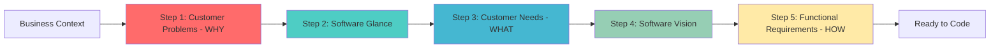
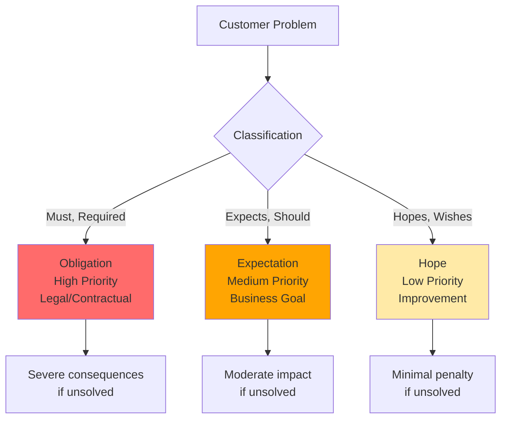

# Problem-Based SRS

[](https://github.com/RafaelGorski/Problem-Based-SRS/releases/tag/v1.0)
[](https://github.com/agentskills/agentskills)
[](https://opensource.org/licenses/MIT)

**Stop building the wrong thing.** Let your AI agent guide you through proven requirements engineering that starts with real customer problems, not feature wish lists.

Works with GitHub Copilot, Claude, and other AI coding assistants to help you create software requirements that actually solve business problems.

## ⚡ What You'll Get

This methodology helps you:

- ✅ **Start with WHY** - Identify real customer problems before writing any requirements
- ✅ **Maintain traceability** - Every feature connects back to a business problem it solves
- ✅ **Avoid scope creep** - Clear priorities based on problem severity (must-have vs nice-to-have)
- ✅ **Reduce rework** - Catch misunderstandings early, before writing code
- ✅ **AI-guided process** - Your AI assistant walks you through each step automatically

**Based on peer-reviewed research** by Gorski & Stadzisz, this approach systematically addresses the #1 cause of software project failures: building what stakeholders *asked for* instead of what they actually *need*.

## 🎯 See It In Action

Here's what happens when you use this methodology:

**Your input:**
```
I need requirements for an inventory management system. Our warehouse
tracks everything in spreadsheets and loses $50k/month due to errors.
```

**The AI guides you through:**

1. **Customer Problems (WHY)** - "Manual spreadsheet tracking causes $50k/month in inventory errors"
2. **Software Glance** - "Web-based inventory system with barcode scanning"
3. **Customer Needs (WHAT)** - "System must track inventory in real-time with 99.9% accuracy"
4. **Software Vision** - "Cloud inventory platform with mobile scanning app"
5. **Functional Requirements (HOW)** - "FR.01.1.1: System shall scan barcodes and update inventory within 2 seconds"

Every requirement traces back to that $50k problem, ensuring you build what actually matters.

## 🚀 Quick Start

**Step 1:** Install (one-time setup)

Ask your AI assistant:
```
Install the Problem-Based SRS skill from RafaelGorski/Problem-Based-SRS
```

**Step 2:** Start your first requirements session

```
/problem-based-srs
```

Your AI will guide you through the complete 5-step process interactively.

> **First time?** Just tell your AI about your project challenge. Example: *"We need a mobile app for field technicians who can't access customer data offline."* The AI will handle the rest.

## 💡 Commands Reference

Once installed, use these commands to work with different parts of the methodology:

| Command | When to Use | What It Does |
|---------|-------------|--------------|
| `/problem-based-srs` | Starting a new project | Guides you through all 5 steps from scratch |
| `/cp` | Analyzing business problems | Identifies and classifies customer problems (WHY) |
| `/glance` | Quick project overview | Creates high-level software summary |
| `/cn` | Defining what to build | Translates problems into customer needs (WHAT) |
| `/vision` | Planning architecture | Documents software architecture and vision |
| `/fr` | Writing requirements | Specifies detailed functional requirements (HOW) |
| `/zigzag` | Quality check | Validates that all requirements trace to problems |

**Common scenarios:**

- 🆕 **New project?** → Use `/problem-based-srs` to start from scratch
- 🔍 **Reviewing existing requirements?** → Use `/fr` then `/zigzag` to validate
- 💡 **Stakeholders proposing solutions instead of problems?** → Use `/cp` to dig deeper
- ✅ **Need to verify requirements quality?** → Use `/zigzag` for traceability check

## 📊 How It Works

The methodology follows a proven 5-step process where each step builds on the previous one:



**The WHY → WHAT → HOW progression ensures:**
- You understand the business problem before designing solutions
- Every requirement traces back to a real customer pain point
- Priorities are clear (must-solve vs nice-to-have)

### Problem Priority Classification

Customer Problems are classified by severity to help you prioritize:



This ensures you're not treating "nice to have" features the same as "business critical" requirements.

## 🛠️ Installation Options

### Recommended: AI-Assisted Installation

The easiest way—just ask your AI assistant:

```
Install the Problem-Based SRS skill from RafaelGorski/Problem-Based-SRS
```

Your AI will handle the installation automatically. Works with GitHub Copilot, Claude, and other agents.

### Alternative: Manual Installation

<details>
<summary>Click to expand manual installation instructions</summary>

#### For Individual Use

Install to your personal skills directory:

```bash
# Clone the repository
git clone https://github.com/RafaelGorski/Problem-Based-SRS.git

# Copy to your AI agent's skills directory
# For Claude Code:
cp -r Problem-Based-SRS/skills/problem-based-srs ~/.claude/skills/

# For GitHub Copilot:
cp -r Problem-Based-SRS/skills/problem-based-srs ~/.copilot/skills/
```

**Skills directory by AI agent:**

| Agent | macOS/Linux | Windows |
|-------|-------------|---------|
| Claude Code | `~/.claude/skills/` | `%USERPROFILE%\.claude\skills\` |
| GitHub Copilot | `~/.copilot/skills/` | `%USERPROFILE%\.copilot\skills\` |
| Gemini CLI | `~/.gemini/skills/` | `%USERPROFILE%\.gemini\skills\` |
| Cline | `~/.cline/skills/` | `%USERPROFILE%\.cline\skills\` |
| Goose | `~/.config/goose/skills/` | `%USERPROFILE%\.config\goose\skills\` |

#### For Teams (Project-Level)

Install into your repository so everyone on the team automatically gets it:

**Using the AgentSkills CLI:**
```bash
npx skills add RafaelGorski/Problem-Based-SRS
```

**Or manually:**
```bash
# Clone the repository
git clone https://github.com/RafaelGorski/Problem-Based-SRS.git

# Copy to your project's skills directory
# For GitHub Copilot:
cp -r Problem-Based-SRS/skills/problem-based-srs your-project/.github/skills/

# For Claude Code:
cp -r Problem-Based-SRS/skills/problem-based-srs your-project/.claude/skills/

# Commit to version control
cd your-project
git add .github/skills/  # or .claude/skills/
git commit -m "Add Problem-Based SRS methodology"
```

**Project-level skills directories:**

| Agent | Project Directory |
|-------|-------------------|
| GitHub Copilot | `.github/skills/` |
| Claude Code | `.claude/skills/` |
| Cursor | `.cursor/skills/` |

> **Tip:** Project-level installation ensures your entire team follows the same requirements methodology and the skill is automatically available in CI/CD.

</details>


## 📚 Learn More

### Documentation

- **[Research Paper](docs/)** - The peer-reviewed methodology by Gorski & Stadzisz
- **[Testing Guide](TESTING.md)** - Quality assurance and test specifications
- **[Contributing](CONTRIBUTING.md)** - Help improve the methodology
- **[Changelog](CHANGELOG.md)** - Version history and updates

### Key Concepts

**Traceability:** Every functional requirement (FR) traces to a customer need (CN), which traces to a customer problem (CP). This ensures nothing gets built without a clear business justification.

**WHY → WHAT → HOW:** The methodology enforces this logical progression:
- **WHY** (Customer Problems) = The business pain you're solving
- **WHAT** (Customer Needs) = Capabilities required to solve it
- **HOW** (Functional Requirements) = Specific features to implement

**AgentSkills Format:** This repository uses the [AgentSkills](https://agentskills.io) open standard, making it compatible with any AI agent that supports the format.

## 🧪 Quality Assurance

This methodology includes comprehensive testing:

- ✅ **98.3% test coverage** (57 of 58 tests passing)
- ✅ **Static validation** of skill format and structure
- ✅ **Semantic validation** of methodology steps
- ✅ **Integration tests** for AI agent compatibility

```bash
# Run tests yourself
pip install pytest strictyaml
pytest tests/ -v
```

## 📋 Version 1.0

Released February 2026 with:

- Complete 5-step methodology with traceability validation
- AgentSkills format for GitHub Copilot, Claude, and other AI agents
- 57+ automated tests for quality assurance
- Comprehensive documentation based on peer-reviewed research

---

**Built with ❤️ by the requirements engineering community** | [Report Issues](https://github.com/RafaelGorski/Problem-Based-SRS/issues) | [MIT License](LICENSE)
