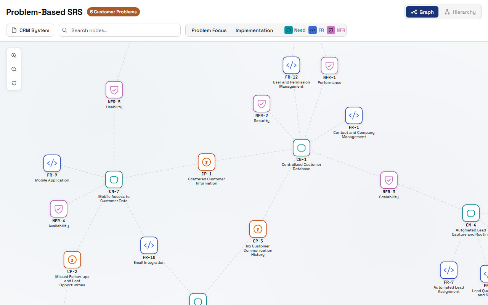
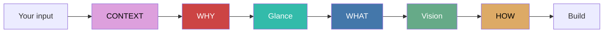
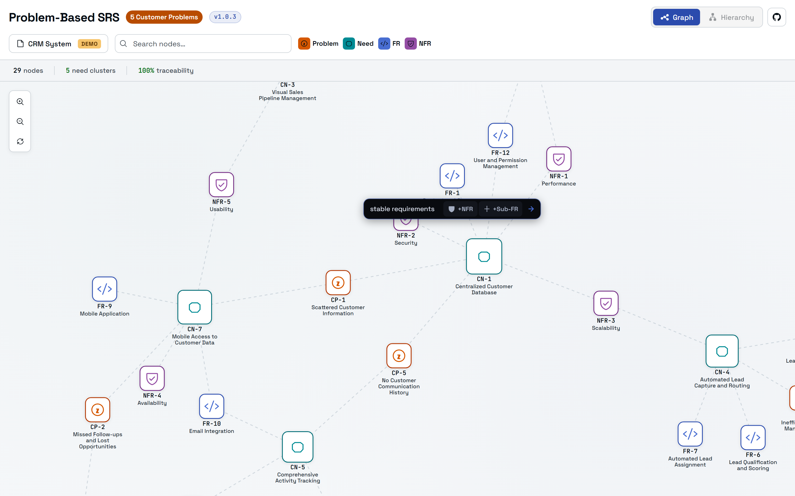
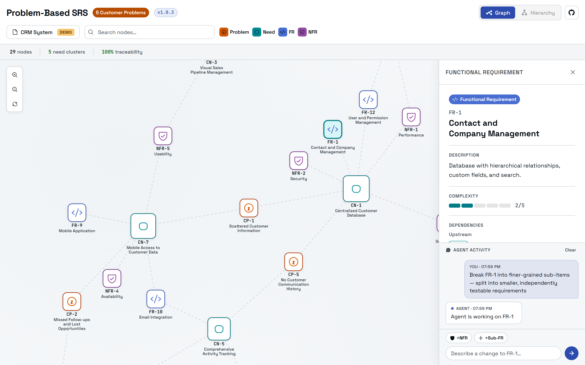

# Problem-Based SRS

[](https://github.com/RafaelGorski/Problem-Based-SRS/releases/tag/v2.2)
[](https://agentskills.io)
[](https://opensource.org/licenses/MIT)

AI-guided requirements engineering that traces every feature back to the customer problem it solves. An [AgentSkill](https://agentskills.io) for GitHub Copilot, Claude Code, and other AI coding assistants.

**Version 2.0 ships two things in one project:**

| | What it is | Where it runs |
|---|------------|---------------|
| 🧠 **Skills** | The Problem-Based SRS methodology as agent-native skills (Business Context → CP → CN → FR, with traceability and validation). | GitHub Copilot, Claude Code, and any AgentSkills-compatible assistant |
| 🗺️ **App** | The **SRS Navigator** — a GitHub Copilot canvas app that visualizes your spec as an interactive graph and lets you decompose and iterate requirements with the agent, in place. | The GitHub Copilot side panel (`/live`) |



## The problem this solves

A stakeholder says: *"We need a reporting dashboard with 20 charts."*

You build it. Three weeks. Ship it. They use 3 charts. The actual problem was slow data access, not visualization. Two weeks wasted, one frustrated team.

This happens because requirements start with *what stakeholders ask for* instead of *what they need*. Problem-Based SRS fixes the order: identify the problem first, then derive the solution.

**With this methodology, the same request becomes:**

> **CP.01**: "Managers must access sales data within 5 seconds to make decisions."

From that problem, you derive the need (CN: real-time data access), then the requirement (FR: data API + 3 targeted charts). Built in one week. Solves the actual problem.

## How it works

Your AI assistant walks you through six steps. Each builds on the previous:


```mermaid
graph LR
    A[Your input] --> B0[CONTEXT]
    B0 --> B[WHY]
    B --> C[Glance]
    C --> D[WHAT]
    D --> E[Vision]
    E --> F[HOW]
    F --> G[Build]

    style B0 fill:#dda0dd,color:#000
    style B fill:#c44,color:#fff
    style C fill:#3ba,color:#fff
    style D fill:#47a,color:#fff
    style E fill:#6a8,color:#fff
    style F fill:#da6,color:#000
```

| Step | Command | You answer | You get |
|------|---------|------------|---------|
| 0. Business Context | `/business-context` | Project identity, constraints, success criteria | Governing principles for all decisions |
| 1. Customer Problems | `/customer-problems` | What's broken and for whom | Prioritized problems (Obligation / Expectation / Hope) |
| 2. Software Glance | `/software-glance` | High-level solution direction | Shared understanding of scope and boundaries |
| 3. Customer Needs | `/customer-needs` | Required outcomes per problem | Measurable success criteria |
| 4. Software Vision | `/software-vision` | Architecture and technical approach | Technical roadmap with stakeholder alignment |
| 5. Functional Requirements | `/functional-requirements` | Detailed behavior specs | Testable requirements traced to problems |

Every requirement traces backward: **FR → CN → CP**. You can always answer *"Why are we building this?"*

Use `/zigzag-validator` at any point to verify the chain is complete.

### Problem classification

Not all problems are equal. The methodology classifies each by severity:

| Class | Verb | Priority | Consequence if unsolved |
|-------|------|----------|------------------------|
| **Obligation** | must | High | Legal, contractual, or operational failure |
| **Expectation** | expects | Medium | Degraded business outcomes |
| **Hope** | hopes | Low | Missed improvement opportunity |

This prevents "everything is P1" by grounding priority in the problem's actual impact.

## Quick start

**Install** (ask your AI assistant):

```
Install the Problem-Based SRS skills from RafaelGorski/Problem-Based-SRS into .github/skills/
```

For Claude Code, use `.claude/skills/` instead. Skills must go in the agent-specific directory, not a `skills/` folder at the repo root.

**Run** your first session:

```
/problem-based-srs
```

Describe your situation. The AI handles the rest:

```
I need requirements for an inventory management system.
Our warehouse tracks everything in spreadsheets and loses $50k/month due to errors.
```

The methodology will produce traced artifacts from business context through functional requirements, stored in your project's `.spec/` directory.

## Full example

Here is one pass through the methodology for the warehouse scenario above:

```
CONTEXT
  Project: InventoryPro — warehouse logistics
  Principle: "Inventory data must reflect physical reality within 0.1% tolerance" (Mandatory)
  Success: "Reduce inventory discrepancy from $50k to $5k/month"

WHY (Customer Problems)
  CP.01  Warehouse must track inventory accurately otherwise $50k/month lost to errors
  CP.02  Staff expects real-time inventory visibility otherwise delays in fulfillment

WHAT (Customer Needs)
  CN.01.1  Warehouse needs system to track inventory with 99.9% accuracy
  CN.02.1  Staff needs system to scan items and update inventory within 2 seconds

HOW (Functional Requirements)
  FR.01.1.1  System shall maintain 99.9% accuracy in inventory counts
  FR.02.1.1  System shall scan barcodes and update inventory database within 2 seconds
```

Every FR traces to a CN, which traces to a CP. The $50k problem is the root. Nothing ships without a reason.

## Commands

| Command | Purpose |
|---------|---------|
| `/problem-based-srs` | Full methodology, all steps |
| `/business-context` | Step 0: project identity and constraints |
| `/customer-problems` | Step 1: identify and classify problems |
| `/software-glance` | Step 2: sketch solution approach |
| `/customer-needs` | Step 3: define required outcomes |
| `/software-vision` | Step 4: architecture and scope |
| `/functional-requirements` | Step 5: detailed, testable requirements |
| `/zigzag-validator` | Verify traceability across all artifacts |
| `/complexity-analysis` | Optional: Axiomatic Design quality analysis |
| `/live` | Launch the **SRS Navigator** canvas to visualize the spec as an interactive graph |

## Visualize it live

This repository is **both** the methodology skill **and** the UX to navigate it. The
**SRS Navigator** is a GitHub Copilot canvas extension (in
[`.github/extensions/srs-navigator/`](.github/extensions/srs-navigator/)) that renders a
specification as an interactive force-directed graph of Customer Problems, Customer
Needs, and Functional/Non-Functional Requirements — explore traceability, filter by
analysis mode, search nodes, and inspect dependencies inside the Copilot side panel.

Run `/live` and your assistant opens the navigator on the current `.spec/` (or a built-in
CRM demo if you haven't created one yet). The extension also bundles the full methodology
as agent tools, so every step is available without leaving the panel.

> Prefer a preview first? The [project website](https://rafaelgorski.github.io/Problem-Based-SRS/)
> plays an app-faithful animation of the chain building itself: Customer Problems first,
> then the Needs that address them, then the Requirements that satisfy them.

### Decompose and iterate with the agent

The navigator isn't read-only — it's where you **refine the spec together with the agent**.
Hover any node to reveal an inline action bar. Describe the change you want, then pick an
action: derive a downstream artifact (`+CN`, `+FR`, `+NFR`) or **decompose** the node into
finer-grained, independently testable sub-items (`+Sub-FR`).



Triggering an action opens the node's detail panel on the right. You see the full
context — description, complexity, and upstream/downstream traceability — alongside a live
**Agent Activity** conversation. Your request is sent to the matching methodology skill, the
agent edits the specification, and the graph refreshes automatically when it's done.



The result: a tight loop where the visual graph, the methodology skills, and the agent all
operate on a single, fully-traced specification.

## Installation

<details>
<summary>All installation methods</summary>

### AI-assisted (recommended)

Ask your AI assistant to install. Specify the target directory:

| Agent | Install command |
|-------|-----------------|
| GitHub Copilot | `Install the Problem-Based SRS skills from RafaelGorski/Problem-Based-SRS into .github/skills/` |
| Claude Code | `Install the Problem-Based SRS skills from RafaelGorski/Problem-Based-SRS into .claude/skills/` |

### Claude Code plugin

```bash
claude --plugin-dir ./Problem-Based-SRS
# or
/plugin install https://github.com/RafaelGorski/Problem-Based-SRS
```

### AgentSkills CLI

```bash
npx skills add RafaelGorski/Problem-Based-SRS
```

### Manual

```bash
git clone https://github.com/RafaelGorski/Problem-Based-SRS.git

# Copy to your agent's skills directory:
cp -r Problem-Based-SRS/skills/problem-based-srs <target>/
```

| Agent | Personal directory | Project directory |
|-------|--------------------|-------------------|
| GitHub Copilot | `~/.copilot/skills/` | `.github/skills/` |
| Claude Code | `~/.claude/skills/` | `.claude/skills/` |
| Gemini CLI | `~/.gemini/skills/` | — |
| Cursor | — | `.cursor/skills/` |
| Cline | `~/.cline/skills/` | — |
| Goose | `~/.config/goose/skills/` | — |

Project-level installation means your whole team uses the same methodology automatically.

</details>

## Repository structure

```
Problem-Based-SRS/
├── agents/problem-based-srs/    # Agent orchestrator
├── skills/
│   ├── problem-based-srs/       # Main skill + case study examples
│   ├── business-context/        # Step 0
│   ├── customer-problems/       # Step 1
│   ├── software-glance/         # Step 2
│   ├── customer-needs/          # Step 3
│   ├── software-vision/         # Step 4
│   ├── functional-requirements/ # Step 5
│   ├── zigzag-validator/        # Traceability validation
│   ├── complexity-analysis/     # Optional: Axiomatic Design
│   └── live/                    # Launch the SRS Navigator canvas
├── .github/extensions/
│   └── srs-navigator/           # Canvas extension (UX) + bundled skills
├── .spec/crm-system.json        # Demo specification for the navigator
├── scripts/                     # build-plugin.py, bump-version, package-extension
├── docs/                        # Research paper and methodology
└── .claude-plugin/              # Plugin manifest
```

Case studies: [`crm-example.md`](skills/problem-based-srs/references/crm-example.md) and [`microer-example.md`](skills/problem-based-srs/references/microer-example.md) walk through complete sessions.

## Two development workflows

This repository is maintained along two complementary tracks:

1. **Agent-native skills** (the methodology). The canonical skills live in
   [`skills/`](skills/) as `SKILL.md` files. Validate and package them with
   `python scripts/build-plugin.py validate` / `package`; CI
   ([`.github/workflows/ci.yml`](.github/workflows/ci.yml)) checks every push and the
   plugin release ([`.github/workflows/create-release.yml`](.github/workflows/create-release.yml))
   publishes the AgentSkills/Claude plugin.

2. **The SRS Navigator canvas app** (the UX). The extension in
   [`.github/extensions/srs-navigator/`](.github/extensions/srs-navigator/) bundles a
   flattened copy of the methodology skills and renders the graph. Its own release
   workflow ([`.github/workflows/release-canvas.yml`](.github/workflows/release-canvas.yml))
   runs the extension test suite, refreshes the bundled skills, bumps the version, and
   publishes packaged archives.

The two tracks are bridged by **skill sync**: the canvas app's bundled `skills/*.md` are
generated from the canonical `skills/<slug>/SKILL.md` in this repo. Run it locally with:

```bash
node .github/extensions/srs-navigator/scripts/sync-skills.mjs   # copy from skills/
```

In this monorepo it copies straight from `skills/` on disk — the single source of truth.
The runtime also reads the canonical `skills/<slug>/SKILL.md` directly, so the bundled
copies only exist for standalone installs and packaging. Maintainers edit a skill **once**
in `skills/`, and both the agent plugin and the canvas app stay in sync.

## Research and standards

Based on the methodology by Gorski & Stadzisz, published as peer-reviewed research.
**DOI:** [10.21529/RESI.2016.1502002](https://www.periodicosibepes.org.br/index.php/reinfo/article/view/2230)

Requirement-writing guidance aligns with [ISO/IEC/IEEE 29148:2018](https://www.iso.org/standard/72089.html) for requirement quality, structured syntax, and bidirectional traceability. Normative keywords follow [BCP 14](https://www.rfc-editor.org/bcp/bcp14) (RFC 2119 / RFC 8174) when written in ALL CAPITALS.

Uses the [AgentSkills](https://agentskills.io) open standard and [Claude Code Plugins](https://code.claude.com/docs/en/plugins.md) format.

## Inspirations

- **[Impeccable](https://github.com/pbakaus/impeccable)** — The clarifying questions pattern: forcing AI agents to stop and ask targeted questions before generating artifacts, rather than making assumptions.
- **[spec-kit](https://github.com/github/spec-kit)** — The project constitution concept: establishing non-negotiable principles and governance before specification work begins. Inspired our Business Context (Step 0) skill.

---

[Changelog](CHANGELOG.md) · [Contributing](CONTRIBUTING.md) · [Report an issue](https://github.com/RafaelGorski/Problem-Based-SRS/issues) · [MIT License](LICENSE)
