# Problem-Based SRS

[](https://github.com/agentskills/agentskills)
[](https://opensource.org/licenses/MIT)

An [Agent Skill](https://github.com/agentskills/agentskills) to use **Problem-Based Software Requirements Specification (SRS)** method in your software project. Designed for integration with AI agents like GitHub Copilot, Claude, and others.

## 📄 Background

This repository is a **continuation of the work** presented in the research paper: **"Problem-Based SRS: A Novel Approach for Software Requirements Specification"** by **Gorski and Stadzisz**

This is a novel approach to improving software requirements specification quality by constructing knowledge about software requirements from knowledge about customer problems. 
The Problem-Based SRS methodology consists of an organization of activities and outcome objects through a process with five main steps, aiming to systematically analyze business context and specify software requirements that truly address customer needs.

The key insight from the research: **accurately capturing business intents of stakeholders remains a major challenge and factor in software project failures**. 
This methodology addresses this by ensuring requirements provide suitable answers to real customer business issues.

> **Supported Formats:** This repository provides [GitHub Copilot prompt files](https://docs.github.com/en/copilot/tutorials/customization-library/prompt-files) (`.github/prompts/`) and [AgentSkills](https://agentskills.io) format (`skills/`) for maximum compatibility.

## 🚀 How to Use

The easiest way to get started is to **ask your AI agent to install and use this skill directly**.

### Quick Start (Recommended)

#### With GitHub Copilot

Open GitHub Copilot Chat in your IDE or on GitHub.com and ask:

```
Install the Problem-Based SRS skill from RafaelGorski/Problem-Based-SRS repository
```

Once installed, launch the methodology by typing:

```
/problem-based-srs
```

Then simply **talk with the agent about the business problems you are trying to solve**. The AI will guide you through the 5-step process automatically.

#### With Claude

In Claude.ai or Claude Code, ask:

```
Install the AgentSkill from https://github.com/RafaelGorski/Problem-Based-SRS
```

Or for Claude Code, you can also say:

```
Add the problem-based-srs skill to my project from RafaelGorski/Problem-Based-SRS
```

### What Happens Next?

After installation, you can start a conversation like:

```
I need to create requirements for a new inventory management system.
Our warehouse currently tracks everything in spreadsheets and we're
losing $50k/month due to inventory discrepancies.
```

The AI agent will:
1. **Detect your starting point** - Whether you have existing requirements or need to start from scratch
2. **Guide you through the 5 steps** - From Customer Problems (CP) to Functional Requirements (FR)
3. **Ensure traceability** - Every requirement traces back to a real business problem
4. **Validate quality** - Using the zigzag validation to check consistency

### Available Commands

Once the skill is active, you can use these commands:

| Command | Description |
|---------|-------------|
| `/problem-based-srs` | Start the full guided methodology |
| `/cp` | Step 1: Identify Customer Problems (the WHY) |
| `/glance` | Step 2: Create Software Glance (high-level view) |
| `/cn` | Step 3: Define Customer Needs (the WHAT) |
| `/vision` | Step 4: Document Software Vision (architecture) |
| `/fr` | Step 5: Specify Functional Requirements (the HOW) |
| `/zigzag` | Validate traceability between artifacts |

### Example Conversation Flow

```
You: /problem-based-srs

AI: I'll guide you through the Problem-Based SRS methodology.
    Let's start by understanding your business context.
    What problem are you trying to solve?

You: Our retail company has 3 warehouse locations. Staff use paper
     forms to track inventory, which often get lost or entered late.
     This causes stock discrepancies.

AI: I've identified the following Customer Problems:

    ### CP-001: Inventory Data Accuracy
    **Statement:** The company must maintain accurate inventory
    records that match physical stock...

    Would you like to continue to the Software Glance, or refine
    these Customer Problems first?
```

### Tips for Best Results

1. **Provide rich context** - Include numbers, constraints, stakeholder roles, and business impact
2. **Follow the process** - Don't skip steps; each builds on the previous
3. **Use `/zigzag` often** - Validate traceability between major steps
4. **Iterate** - Refine outputs before moving to the next step
5. **Save artifacts** - Keep each step's output in markdown files for reference

## 🎯 Purpose

Enable software engineers and requirements analysts to leverage AI agents for better requirements engineering by providing:

- **Structured Skills** for each phase of requirements gathering
- **Problem-first methodology** that ensures requirements solve real needs
- **AI agent integration** compatible with Claude Code, Claude.ai, and Claude API
- **Lightweight approach** with no heavy tooling or frameworks
- **Examples and templates** for immediate use

## 📁 Repository Structure

This repository supports multiple formats:
- **`.github/prompts/`** - [GitHub Copilot prompt files](https://docs.github.com/en/copilot/tutorials/customization-library/prompt-files) for VS Code, Visual Studio, and JetBrains IDEs
- **`skills/`** - [AgentSkills](https://agentskills.io) format for Claude Code and Claude.ai
```
.github/prompts/            # GitHub Copilot prompt files (VS Code, Visual Studio, JetBrains)
├── problem-based-srs.md       # Main orchestrator prompt
├── cp.prompt.md               # Step 1: Customer Problems
├── glance.prompt.md           # Step 2: Software Glance
├── cn.prompt.md               # Step 3: Customer Needs
├── vision.prompt.md           # Step 4: Software Vision
├── fr.prompt.md               # Step 5: Functional Requirements
└── zigzag.prompt.md           # Quality validation tool

skills/problem-based-srs/   # AgentSkills format (Claude Code, Claude.ai)
├── SKILL.md                # Main orchestrator skill
└── references/             # Detailed instructions for each step
    ├── step1-customer-problems.md
    ├── step2-software-glance.md
    ├── step3-customer-needs.md
    ├── step4-software-vision.md
    ├── step5-functional-requirements.md
    └── zigzag-validator.md
```

This repository supports two formats:
- **`.github/prompts/`** - [GitHub Copilot prompt files](https://docs.github.com/en/copilot/tutorials/customization-library/prompt-files) for VS Code, Visual Studio, and JetBrains IDEs
- **`skills/`** - [AgentSkills](https://agentskills.io) format for Claude Code and Claude.ai

## 📊 Methodology Overview

### The 5-Step Process


### Development Workflow Integration


## 🛠️ Getting Started

This section guides developers new to AI agents through setting up and using the Problem-Based SRS methodology with GitHub Copilot and Claude.

---

### Prerequisites

Before using these prompts, ensure you have the following:

#### For GitHub Copilot (Recommended for IDE users)

| Requirement | Description | Installation |
|-------------|-------------|--------------|
| **GitHub Account** | Required for Copilot access | [Sign up](https://github.com/signup) |
| **GitHub Copilot Subscription** | Individual, Business, or Enterprise | [Get Copilot](https://github.com/features/copilot) |
| **Supported IDE** | VS Code, Visual Studio, or JetBrains IDE | See below |
| **Copilot Extension** | IDE extension for your editor | See below |

**IDE Setup:**

<details>
<summary><strong>VS Code</strong></summary>

1. Install [VS Code](https://code.visualstudio.com/)
2. Open Extensions (Ctrl+Shift+X / Cmd+Shift+X)
3. Search and install **"GitHub Copilot"**
4. Search and install **"GitHub Copilot Chat"**
5. Sign in with your GitHub account when prompted
6. Verify Copilot icon appears in status bar

</details>

<details>
<summary><strong>Visual Studio</strong></summary>

1. Install [Visual Studio 2022](https://visualstudio.microsoft.com/) (v17.6+)
2. Go to Extensions → Manage Extensions
3. Search and install **"GitHub Copilot"**
4. Restart Visual Studio
5. Sign in with your GitHub account

</details>

<details>
<summary><strong>JetBrains IDEs</strong></summary>

1. Install your preferred JetBrains IDE (IntelliJ IDEA, PyCharm, WebStorm, etc.)
2. Go to Settings → Plugins
3. Search and install **"GitHub Copilot"**
4. Restart the IDE
5. Sign in with your GitHub account

</details>

#### For Claude (Recommended for web/conversation-based work)

| Requirement | Description | How to Get |
|-------------|-------------|------------|
| **Anthropic Account** | Required for Claude access | [Sign up](https://claude.ai) |
| **Claude Pro** (optional) | Extended context and usage | [Upgrade](https://claude.ai/settings) |
| **Claude Code** (optional) | Terminal-based Claude for coding | [Install Guide](https://docs.anthropic.com/en/docs/claude-code) |

---

### Installation

#### Method 1: Clone the Repository (Recommended)

Clone this repository to include the prompts in your project:

```bash
# Clone the repository
git clone https://github.com/RafaelGorski/Problem-Based-SRS.git

# Or add as a submodule to your existing project
git submodule add https://github.com/RafaelGorski/Problem-Based-SRS.git .srs-methodology
```

After cloning, copy the skill to the appropriate location for your agent:

| Agent | Skills directory (macOS/Linux) | Skills directory (Windows) |
|-------|-------------------------------|---------------------------|
| Claude Code | `~/.claude/skills/` | `%USERPROFILE%\.claude\skills\` |
| VS Code and GitHub Copilot | `~/.copilot/skills/` | `%USERPROFILE%\.copilot\skills\` |
| Gemini CLI | `~/.gemini/skills/` | `%USERPROFILE%\.gemini\skills\` |
| Cline | `~/.cline/skills/` | `%USERPROFILE%\.cline\skills\` |
| Goose | `~/.config/goose/skills/` | `%USERPROFILE%\.config\goose\skills\` |
| Codex | `~/.codex/skills/` | `%USERPROFILE%\.codex\skills\` |

**Example (macOS/Linux):**
```bash
# Clone the repository
git clone https://github.com/RafaelGorski/Problem-Based-SRS.git

# Copy skill to Claude Code
cp -r Problem-Based-SRS/skills/problem-based-srs ~/.claude/skills/

# Or copy skill to GitHub Copilot
cp -r Problem-Based-SRS/skills/problem-based-srs ~/.copilot/skills/
```

**Example (Windows PowerShell):**
```powershell
# Clone the repository
git clone https://github.com/RafaelGorski/Problem-Based-SRS.git

# Copy skill to Claude Code
Copy-Item -Recurse Problem-Based-SRS\skills\problem-based-srs $env:USERPROFILE\.claude\skills\

# Or copy skill to GitHub Copilot
Copy-Item -Recurse Problem-Based-SRS\skills\problem-based-srs $env:USERPROFILE\.copilot\skills\
```

#### Method 2: Copy Specific Files

Copy only the files you need:

**For GitHub Copilot:**
```
Copy .github/prompts/ → your-project/.github/prompts/
```

**For Claude Code:**
```
Copy skills/problem-based-srs/ → your-project/skills/problem-based-srs/
```

---

### Usage Guide

#### Using with GitHub Copilot (VS Code, Visual Studio, JetBrains)

GitHub Copilot automatically discovers `.prompt.md` files in your `.github/prompts/` directory.

**Step 1: Open Copilot Chat**
- **VS Code**: Press `Ctrl+Shift+I` (Windows/Linux) or `Cmd+Shift+I` (Mac)
- **Visual Studio**: View → GitHub Copilot Chat
- **JetBrains**: Right-click → GitHub Copilot → Open Chat

**Step 2: Use a Prompt Command**

Type the prompt command in the chat. Available commands:

| Command | Purpose | When to Use |
|---------|---------|-------------|
| `/cp` | Customer Problems | Start here! Identify the WHY behind your project |
| `/glance` | Software Glance | Create high-level system overview |
| `/cn` | Customer Needs | Define WHAT outcomes software should provide |
| `/vision` | Software Vision | Document scope and architecture boundaries |
| `/fr` | Functional Requirements | Specify HOW the system will behave |
| `/zigzag` | Validate Traceability | Check consistency between CP → CN → FR |
| `/problem-based-srs` | Full Orchestration | Let the AI guide you through all 5 steps |

**Step 3: Provide Context**

When prompted, provide:
```
/cp

Business Context: We're building an inventory management system for a
warehouse that currently tracks everything in spreadsheets. They have
3 warehouse locations and 50 employees.
```

**Example Session:**
```
You: /cp

Copilot: I'll help you identify Customer Problems. Please describe your
business context...

You: Our retail company loses $50k/month due to inventory discrepancies
between physical stock and system records. Warehouse staff use paper
forms that get lost or entered late.

Copilot: Based on your context, here are the identified Customer Problems:

### CP-001: Inventory Data Accuracy
**Statement:** The company must maintain accurate inventory records
that match physical stock otherwise loses $50k monthly in discrepancies.
**Classification:** Obligation
...
```

#### Using with Claude.ai (Web Interface)

**Step 1: Start a New Conversation**

Go to [claude.ai](https://claude.ai) and start a new chat.

**Step 2: Upload the Skill**

1. Click the attachment/upload icon
2. Upload the `skills/problem-based-srs/SKILL.md` file
3. Also upload the files from `skills/problem-based-srs/references/` folder

**Step 3: Start Your Session**
```
I've uploaded the Problem-Based SRS methodology. I need help creating
requirements for [your project description].

Let's start with Step 1: Customer Problems.
```

**Alternative: Copy-Paste Approach**

If you prefer not to upload files:

1. Open the specific step file you need (e.g., `.github/prompts/cp.prompt.md`)
2. Copy the entire content
3. Paste it at the start of your Claude conversation
4. Provide your business context

#### Using with Claude Code (Terminal)

Claude Code automatically discovers skills in your workspace.

**Step 1: Install Claude Code**
```bash
# macOS
brew install anthropic/tap/claude-code

# Or via npm
npm install -g @anthropic-ai/claude-code
```

**Step 2: Navigate to Your Project**
```bash
cd your-project
# Ensure skills/problem-based-srs/ exists in your project
```

**Step 3: Start Claude Code**
```bash
claude
```

**Step 4: Use the Methodology**

The skill auto-discovers. Just describe what you need:
```
> Help me create requirements for my inventory management system.
  The warehouse currently tracks everything in spreadsheets.
```

Claude Code will detect you need to start at Step 1 and guide you through the process.

---

### Workflow Examples

#### Example 1: New Project from Scratch

```mermaid
sequenceDiagram
    participant You
    participant AI as GitHub Copilot / Claude    
    
    You->>AI: /cp with business context
    AI->>You: Customer Problems (CP-001, CP-002...)
    
    You->>AI: /glance with CPs
    AI->>You: Software Glance document
    
    You->>AI: /cn with CPs + Glance
    AI->>You: Customer Needs (CN-001, CN-002...)
    
    You->>AI: /zigzag to validate CN→CP traceability
    AI->>You: Validation report
    
    You->>AI: /vision with CNs + Glance
    AI->>You: Software Vision document
    
    You->>AI: /fr with CNs + Vision
    AI->>You: Functional Requirements (FR-001...)
    
    You->>AI: /zigzag to validate FR→CN→CP traceability
    AI->>You: Final validation report
```



#### Example 2: Validating Existing Requirements

If you already have requirements that need structure:
```
/fr

I have these existing requirements that need to be validated and
structured. Please review them and ensure they trace to customer needs:

1. User shall be able to log in
2. System shall display inventory levels
3. Admin shall generate reports
...
```

---

### Troubleshooting

| Issue | Solution |
|-------|----------|
| **Prompts not appearing in Copilot** | Ensure `.github/prompts/` folder is in your workspace root. Restart your IDE. |
| **"Command not found" error** | Verify Copilot Chat extension is installed and you're signed in. |
| **Claude doesn't follow methodology** | Re-upload the SKILL.md file or copy-paste the specific prompt at the start of your message. |
| **Outputs are too generic** | Provide more specific business context. Include numbers, constraints, and stakeholder details. |
| **Traceability validation fails** | Use `/zigzag` to identify gaps, then revisit the step with missing traceability. |
---

### Tips for New AI Agent Users

1. **Be Specific**: The more context you provide, the better the output. Include business domain, constraints, numbers, and stakeholder roles.

2. **Iterate**: Don't expect perfect results on the first try. Refine and ask for adjustments.

3. **Maintain Artifacts**: Save each step's output in a markdown file for future reference and traceability.

4. **Validate Often**: Use `/zigzag` between major steps to catch issues early.

5. **Trust the Process**: The 5-step methodology is designed to prevent common requirements pitfalls. Don't skip steps.

## 🚀 Quick Start for Engineers

### Using GitHub Copilot Prompt Files (Recommended)

The prompts are available as `.prompt.md` files in `.github/prompts/`. In VS Code, Visual Studio, or JetBrains IDEs:

```
/cp           # Start with Customer Problems
/glance       # Create Software Glance
/cn           # Generate Customer Needs
/vision       # Build Software Vision
/fr           # Specify Functional Requirements
/zigzag       # Validate traceability
/problem-based-srs  # Full methodology orchestration
```

### Using with Any AI Agent (Universal)

The methodology works with any LLM (ChatGPT, DeepSeek, Claude, Llama, etc.).  

**Option 1: AgentSkills (Open Standard)**
The `skills/` directory follows the [AgentSkills standard](https://agentskills.io), compatible with any tool that implements it.

**For Claude Code:**
The skill will auto-discover when this repository is in your workspace.

**For Claude.ai:**
Upload the skill from `skills/problem-based-srs/` (including the references folder).

### For New Features

Simply describe your business context or problem:
```
I need to create requirements for [feature name]

Business Context: [describe current situation]
```
The skill will automatically:
1. Detect what step you're on
2. Load the appropriate reference guide
3. Walk you through the process
4. Ensure traceability back to business problems

### Specific Step Examples

**Start with Customer Problems:**
```
Help me identify customer problems for my inventory management system
```

#### Problem Classification

Customer Problems are classified by severity:


**Create Software Glance:**
```
I have customer problems documented, need to create a software glance
```

**Validate Traceability:**
```
Check if my requirements properly trace back to customer problems
```

Artifact Traceability: Each artifact traces back to ensure requirements solve real problems:


## 💡 Usage Patterns

### Pattern 1: Full Feature Development
**When:** Building a new feature from business need  
**Start with:** `/problem-based-srs` prompt  
**Follow:** All 5 steps sequentially

### Pattern 2: Requirements Refinement
**When:** You have draft requirements that need structure  
**Start with:** `/fr` in review mode  
**Then:** Work backwards to validate against CNs and CPs

### Pattern 3: Problem Discovery
**When:** Stakeholders describe solutions, not problems  
**Start with:** `/cp` in generation mode  
**Use discovery questions** to elicit actual problems

### Pattern 4: Quality Gate
**When:** Validating completeness before implementation  
**Start with:** `/zigzag`  
**Verify:** All CPs are addressed, all CNs trace to CPs, all Requirements trace to CNs

## 🔧 Integration with Development Workflow

### During Sprint Planning
1. Use `/cp` to capture user stories as customer problems
2. Use `/cn` to define acceptance criteria as customer needs
3. Use `/fr` to break down into technical requirements

### During Feature Design
1. Reference `/glance` for high-level solution approach
2. Reference `/vision` for architectural decisions and constraints
3. Use `/zigzag` to ensure design addresses all needs

### During Implementation
1. Keep `/fr` requirements as your implementation checklist
2. Trace each requirement back to its CN and CP for context
3. Update requirements if new problems are discovered

### During Code Review
1. Verify implementation satisfies requirements from `/fr`
2. Check that requirements still trace to customer needs
3. Validate no scope creep beyond identified problems

## 📚 Additional Resources

- **Full Methodology:** See `docs/` for detailed research paper
- **GitHub Copilot Prompts:** See `.github/prompts/` for prompt files
- **AgentSkills:** See `skills/problem-based-srs/` for Claude Code integration
- **Examples:** Each prompt file contains real-world examples
