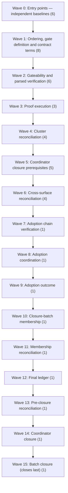

# Open-Issue Remediation Plan

> Dependency-ordered plan to close the **45 open issues** in this repository, produced with
> `/problem-based-srs functional-requirements` on 2026-09-29.
>
> Every open issue has a **remediation sub-issue** linked to it on GitHub, carrying the
> requirement statement, acceptance criteria, executable verification procedure and
> dependency edges. This document is the **sequence**; the sub-issues are the **work**.

## At a glance

| | |
|---|---|
| Open issues planned | **45** (all of them) |
| Remediation sub-issues created & linked | **45** (#350–#395) |
| Customer Problems | 5 |
| Customer Needs | 7 |
| Functional Requirements | 45 |
| Non-Functional Requirements | 5 |
| Acceptance criteria | 225 |
| Execution waves | 16 (true antichains — no intra-wave dependencies) |
| Verified by Playwright + screenshots | 5 |
| Verified by CLI | 40 |

Full requirement files live in `.spec/functional-requirements/` and
`.spec/non-functional-requirements/`. That folder is `.gitignore`d by design
(only the demo spec is tracked), so the **GitHub sub-issues are the durable record** —
each one reproduces its requirement in full.

## Why these issues are still open

Five business problems explain all 45. Each was identified from the issue bodies
themselves, not from the code.

| CP | Cluster | Problem | Open issues |
|----|---------|---------|-------------|
| **CP.01** | Release & version provenance | Statements about which version of the product is published are made without being checked against what is actually published, so documentation, announcements and release evidence can describe a version that no user can obtain. | 8 |
| **CP.02** | Closure gating & ledger | Whether an issue may be closed is decided by human reading rather than by a mechanical gate, so issues are closed on evidence that is stale, missing, or generated in an earlier session than the closure itself. | 14 |
| **CP.03** | Registry drift (skills.sh) | The third-party registry that advertises this project drifts from what the repository ships, and refresh attempts are judged by whether a command exited cleanly rather than by whether the published page changed. | 11 |
| **CP.04** | Adoption evidence | Adoption of the product is asserted without a pre-registered experiment, so a favourable reading of an informal observation cannot be distinguished from a real result. | 10 |
| **CP.05** | Proof & metadata integrity | Proofs and dependency metadata degrade silently: a behavior suite that no longer runs and a lockfile that no longer matches its manifest both look identical to a healthy repository. | 2 |

The common shape: **work was described rather than executed and evidenced.** Nearly every
open issue already has exactly one *closed* sub-issue from a previous round, yet the parent
stayed open — the prior round produced narrative, not artefacts. This plan therefore makes
the evidence, not the description, the closing condition.

## How each fix is proven

Two verification surfaces, chosen per issue by what the issue actually changes.

### 📸 Playwright + screenshots — the canvas app (5 issues)

```bash
cd .github/extensions/srs-navigator
npm ci
node scripts/serve-canvas.mjs            # or: node ../../../evals/tools/open-archive-canvas.mjs <asset>
npx playwright test --reporter=list      # screenshots land in test-results/
```

Every screenshot MUST be captured from the **running canvas served from the published
release archive** — never the working tree — MUST show the extension version the canvas
itself reports, and MUST be attached to its sub-issue. A described-but-uncaptured
screenshot does not close an issue.

| Issue | Sub-issue | What the screenshot proves |
|-------|-----------|----------------------------|
| [#162](https://github.com/RafaelGorski/Problem-Based-SRS/issues/162) | [#365](https://github.com/RafaelGorski/Problem-Based-SRS/issues/365) | Rehearse Canvas Recovery And Published-Archive Rendering |
| [#138](https://github.com/RafaelGorski/Problem-Based-SRS/issues/138) | [#371](https://github.com/RafaelGorski/Problem-Based-SRS/issues/371) | Prove /live Provenance From The Published Canvas Archive |
| [#308](https://github.com/RafaelGorski/Problem-Based-SRS/issues/308) | [#377](https://github.com/RafaelGorski/Problem-Based-SRS/issues/377) | Make Install-To-First-Graph Executable In One Pass On A Clean Machine |
| [#310](https://github.com/RafaelGorski/Problem-Based-SRS/issues/310) | [#382](https://github.com/RafaelGorski/Problem-Based-SRS/issues/382) | Run The External /live Experiment Against The Pre-Registered Contract |
| [#142](https://github.com/RafaelGorski/Problem-Based-SRS/issues/142) | [#389](https://github.com/RafaelGorski/Problem-Based-SRS/issues/389) | Run One External /live Adoption Experiment And Record The Outcome |

### ⌨️ CLI — the skills, release and registry tooling (40 issues)

```bash
cd .github/extensions/srs-navigator && npm ci && npm test   # 307 tests, deterministic, offline
cd ../../.. && node --test evals/tests/*.test.mjs
python scripts/build-plugin.py validate
node scripts/check-distribution.mjs --strict
node evals/tools/issue-ledger.mjs --issue <n>
```

Every command output MUST be captured with its run identifier or timestamp and attached to
its sub-issue. A described-but-unrun command does not close an issue.

## Execution sequence

Waves are **longest-path topological levels** over the dependency graph, so every wave is a
true antichain: nothing in wave *n* depends on anything else in wave *n*, and everything it
depends on is in waves *< n*. Wave 0 can start immediately, in parallel, by six people.



### Wave 0 — Entry points — independent baselines

No prerequisites. Capture the raw before-states, classifications and proof surfaces that every later comparison is measured against. Six issues can start immediately and in parallel.

| FR | Parent issue | Remediation sub-issue | Blocked by | Verify |
|----|--------------|-----------------------|-----------|--------|
| `FR.01.1.1` | [#183](https://github.com/RafaelGorski/Problem-Based-SRS/issues/183) — Restate release claim to the current published canvas version | [#350](https://github.com/RafaelGorski/Problem-Based-SRS/issues/350) | — | ⌨️ |
| `FR.02.1.1` | [#182](https://github.com/RafaelGorski/Problem-Based-SRS/issues/182) — Classify #139's release claim and verify parser determinacy | [#352](https://github.com/RafaelGorski/Problem-Based-SRS/issues/352) | — | ⌨️ |
| `FR.03.1.1` | [#190](https://github.com/RafaelGorski/Problem-Based-SRS/issues/190) — Capture the parsed registry before-state and record the re-crawl request | [#353](https://github.com/RafaelGorski/Problem-Based-SRS/issues/353) | — | ⌨️ |
| `FR.04.1.1` | [#309](https://github.com/RafaelGorski/Problem-Based-SRS/issues/309) — Pre-register the adoption contract: threshold, window and outcome rule | [#354](https://github.com/RafaelGorski/Problem-Based-SRS/issues/354) | — | ⌨️ |
| `FR.05.1.1` | [#294](https://github.com/RafaelGorski/Problem-Based-SRS/issues/294) — Restore the model-behavior proof so the anti-drift claim is exercised | [#355](https://github.com/RafaelGorski/Problem-Based-SRS/issues/355) | — | ⌨️ |
| `FR.05.1.2` | [#346](https://github.com/RafaelGorski/Problem-Based-SRS/issues/346) — Track security review and lockfile version metadata drift | [#356](https://github.com/RafaelGorski/Problem-Based-SRS/issues/356) | — | ⌨️ |

### Wave 1 — Ordering, gate definition and contract terms

Impose ordering on the captured evidence, define (but do not execute) the gate rules, and write down the adoption terms.

| FR | Parent issue | Remediation sub-issue | Blocked by | Verify |
|----|--------------|-----------------------|-----------|--------|
| `FR.01.1.2` | [#306](https://github.com/RafaelGorski/Problem-Based-SRS/issues/306) — Restate every canvas release claim to the currently published version and republish archive-derived evidence | [#357](https://github.com/RafaelGorski/Problem-Based-SRS/issues/357) | [#183](https://github.com/RafaelGorski/Problem-Based-SRS/issues/183) | ⌨️ |
| `FR.02.1.2` | [#164](https://github.com/RafaelGorski/Problem-Based-SRS/issues/164) — Make the report-only closure gate a required release-process step | [#358](https://github.com/RafaelGorski/Problem-Based-SRS/issues/358) | [#182](https://github.com/RafaelGorski/Problem-Based-SRS/issues/182) | ⌨️ |
| `FR.02.1.3` | [#174](https://github.com/RafaelGorski/Problem-Based-SRS/issues/174) — Define and review the hardened closure-gate mutation matrix | [#359](https://github.com/RafaelGorski/Problem-Based-SRS/issues/359) | [#182](https://github.com/RafaelGorski/Problem-Based-SRS/issues/182) | ⌨️ |
| `FR.03.1.2` | [#173](https://github.com/RafaelGorski/Problem-Based-SRS/issues/173) — Sequence registry before-state capture and re-crawl submission evidence | [#360](https://github.com/RafaelGorski/Problem-Based-SRS/issues/360) | [#190](https://github.com/RafaelGorski/Problem-Based-SRS/issues/190) | ⌨️ |
| `FR.03.1.3` | [#301](https://github.com/RafaelGorski/Problem-Based-SRS/issues/301) — Verify the re-crawl by parsed content rather than by exit code | [#361](https://github.com/RafaelGorski/Problem-Based-SRS/issues/361) | [#190](https://github.com/RafaelGorski/Problem-Based-SRS/issues/190) | ⌨️ |
| `FR.03.1.7` | [#184](https://github.com/RafaelGorski/Problem-Based-SRS/issues/184) — Record #140's non-claim and link the registry capture | [#362](https://github.com/RafaelGorski/Problem-Based-SRS/issues/362) | [#190](https://github.com/RafaelGorski/Problem-Based-SRS/issues/190) | ⌨️ |
| `FR.04.1.2` | [#185](https://github.com/RafaelGorski/Problem-Based-SRS/issues/185) — Predeclare adoption threshold, observation window, and outcome rule | [#363](https://github.com/RafaelGorski/Problem-Based-SRS/issues/363) | [#309](https://github.com/RafaelGorski/Problem-Based-SRS/issues/309) | ⌨️ |
| `FR.04.1.7` | [#188](https://github.com/RafaelGorski/Problem-Based-SRS/issues/188) — Record #148's release-claim state and validate its contract gate | [#364](https://github.com/RafaelGorski/Problem-Based-SRS/issues/364) | [#309](https://github.com/RafaelGorski/Problem-Based-SRS/issues/309) | ⌨️ |

### Wave 2 — Gateability and parsed verification

Make the coordinator issues machine-evaluable and run the first parsed content comparisons.

| FR | Parent issue | Remediation sub-issue | Blocked by | Verify |
|----|--------------|-----------------------|-----------|--------|
| `FR.01.1.3` | [#162](https://github.com/RafaelGorski/Problem-Based-SRS/issues/162) — Rehearse safe canvas recovery and published-archive rendering | [#365](https://github.com/RafaelGorski/Problem-Based-SRS/issues/365) | [#306](https://github.com/RafaelGorski/Problem-Based-SRS/issues/306) | 📸 |
| `FR.02.1.5` | [#186](https://github.com/RafaelGorski/Problem-Based-SRS/issues/186) — Make #145 gateable and reconcile its acceptance ledger | [#366](https://github.com/RafaelGorski/Problem-Based-SRS/issues/366) | [#182](https://github.com/RafaelGorski/Problem-Based-SRS/issues/182), [#164](https://github.com/RafaelGorski/Problem-Based-SRS/issues/164) | ⌨️ |
| `FR.02.2.3` | [#189](https://github.com/RafaelGorski/Problem-Based-SRS/issues/189) — Record a validated release-claim census for the closure batch | [#367](https://github.com/RafaelGorski/Problem-Based-SRS/issues/367) | [#182](https://github.com/RafaelGorski/Problem-Based-SRS/issues/182), [#183](https://github.com/RafaelGorski/Problem-Based-SRS/issues/183), [#184](https://github.com/RafaelGorski/Problem-Based-SRS/issues/184), [#188](https://github.com/RafaelGorski/Problem-Based-SRS/issues/188) | ⌨️ |
| `FR.03.1.4` | [#175](https://github.com/RafaelGorski/Problem-Based-SRS/issues/175) — Verify the skills.sh re-crawl by parsed content and explicit unreadable-state handling | [#368](https://github.com/RafaelGorski/Problem-Based-SRS/issues/368) | [#173](https://github.com/RafaelGorski/Problem-Based-SRS/issues/173) | ⌨️ |
| `FR.03.1.6` | [#187](https://github.com/RafaelGorski/Problem-Based-SRS/issues/187) — Make #147 gateable and link its parsed registry evidence | [#369](https://github.com/RafaelGorski/Problem-Based-SRS/issues/369) | [#173](https://github.com/RafaelGorski/Problem-Based-SRS/issues/173) | ⌨️ |
| `FR.03.1.8` | [#303](https://github.com/RafaelGorski/Problem-Based-SRS/issues/303) — Coordinate the refresh end to end: request recorded, elapsed, verified by content | [#370](https://github.com/RafaelGorski/Problem-Based-SRS/issues/370) | [#190](https://github.com/RafaelGorski/Problem-Based-SRS/issues/190), [#301](https://github.com/RafaelGorski/Problem-Based-SRS/issues/301) | ⌨️ |

### Wave 3 — Proof execution

Execute the mutation matrix and the archive-provenance demonstration. This is where claims become evidence.

| FR | Parent issue | Remediation sub-issue | Blocked by | Verify |
|----|--------------|-----------------------|-----------|--------|
| `FR.01.1.4` | [#138](https://github.com/RafaelGorski/Problem-Based-SRS/issues/138) — Prove /live provenance from the current published canvas archive | [#371](https://github.com/RafaelGorski/Problem-Based-SRS/issues/371) | [#162](https://github.com/RafaelGorski/Problem-Based-SRS/issues/162), [#183](https://github.com/RafaelGorski/Problem-Based-SRS/issues/183), [#306](https://github.com/RafaelGorski/Problem-Based-SRS/issues/306) | 📸 |
| `FR.02.1.4` | [#194](https://github.com/RafaelGorski/Problem-Based-SRS/issues/194) — Execute the closure-gate mutation matrix after prerequisite issues are gateable | [#372](https://github.com/RafaelGorski/Problem-Based-SRS/issues/372) | [#174](https://github.com/RafaelGorski/Problem-Based-SRS/issues/174), [#186](https://github.com/RafaelGorski/Problem-Based-SRS/issues/186) | ⌨️ |
| `FR.03.1.5` | [#195](https://github.com/RafaelGorski/Problem-Based-SRS/issues/195) — Verify the skills.sh re-crawl with a parsed before/after diff | [#373](https://github.com/RafaelGorski/Problem-Based-SRS/issues/373) | [#190](https://github.com/RafaelGorski/Problem-Based-SRS/issues/190), [#175](https://github.com/RafaelGorski/Problem-Based-SRS/issues/175) | ⌨️ |

### Wave 4 — Cluster reconciliation

Roll proven verifications up into their cluster coordinators and establish the clean-machine install path.

| FR | Parent issue | Remediation sub-issue | Blocked by | Verify |
|----|--------------|-----------------------|-----------|--------|
| `FR.01.2.1` | [#313](https://github.com/RafaelGorski/Problem-Based-SRS/issues/313) — Gate the announcement on verified surface version parity | [#374](https://github.com/RafaelGorski/Problem-Based-SRS/issues/374) | [#138](https://github.com/RafaelGorski/Problem-Based-SRS/issues/138), [#183](https://github.com/RafaelGorski/Problem-Based-SRS/issues/183), [#306](https://github.com/RafaelGorski/Problem-Based-SRS/issues/306) | ⌨️ |
| `FR.02.1.6` | [#145](https://github.com/RafaelGorski/Problem-Based-SRS/issues/145) — Reconcile closure-gate evidence after gateability and mutation proof | [#375](https://github.com/RafaelGorski/Problem-Based-SRS/issues/375) | [#174](https://github.com/RafaelGorski/Problem-Based-SRS/issues/174), [#186](https://github.com/RafaelGorski/Problem-Based-SRS/issues/186), [#194](https://github.com/RafaelGorski/Problem-Based-SRS/issues/194) | ⌨️ |
| `FR.03.1.9` | [#304](https://github.com/RafaelGorski/Problem-Based-SRS/issues/304) — Close out skills.sh verification: names cleared and content confirmed current | [#376](https://github.com/RafaelGorski/Problem-Based-SRS/issues/376) | [#175](https://github.com/RafaelGorski/Problem-Based-SRS/issues/175), [#187](https://github.com/RafaelGorski/Problem-Based-SRS/issues/187), [#195](https://github.com/RafaelGorski/Problem-Based-SRS/issues/195) | ⌨️ |
| `FR.04.1.3` | [#308](https://github.com/RafaelGorski/Problem-Based-SRS/issues/308) — Make install-to-first-graph executable in one pass on a clean machine | [#377](https://github.com/RafaelGorski/Problem-Based-SRS/issues/377) | [#138](https://github.com/RafaelGorski/Problem-Based-SRS/issues/138) | 📸 |

### Wave 5 — Coordinator closure prerequisites

Close out the closure-gate and registry coordinators and run the external experiment.

| FR | Parent issue | Remediation sub-issue | Blocked by | Verify |
|----|--------------|-----------------------|-----------|--------|
| `FR.01.2.2` | [#314](https://github.com/RafaelGorski/Problem-Based-SRS/issues/314) — Publish the announcement once every surface agrees, at the versions actually published | [#378](https://github.com/RafaelGorski/Problem-Based-SRS/issues/378) | [#313](https://github.com/RafaelGorski/Problem-Based-SRS/issues/313) | ⌨️ |
| `FR.01.2.4` | [#316](https://github.com/RafaelGorski/Problem-Based-SRS/issues/316) — Reconcile the weekly release report against what actually shipped | [#379](https://github.com/RafaelGorski/Problem-Based-SRS/issues/379) | [#313](https://github.com/RafaelGorski/Problem-Based-SRS/issues/313) | ⌨️ |
| `FR.02.1.7` | [#139](https://github.com/RafaelGorski/Problem-Based-SRS/issues/139) — Make release-claim closure gating decidable and required | [#380](https://github.com/RafaelGorski/Problem-Based-SRS/issues/380) | [#145](https://github.com/RafaelGorski/Problem-Based-SRS/issues/145), [#164](https://github.com/RafaelGorski/Problem-Based-SRS/issues/164), [#182](https://github.com/RafaelGorski/Problem-Based-SRS/issues/182) | ⌨️ |
| `FR.03.1.10` | [#147](https://github.com/RafaelGorski/Problem-Based-SRS/issues/147) — Verify the skills.sh re-crawl by parsed before/after content | [#381](https://github.com/RafaelGorski/Problem-Based-SRS/issues/381) | [#175](https://github.com/RafaelGorski/Problem-Based-SRS/issues/175), [#187](https://github.com/RafaelGorski/Problem-Based-SRS/issues/187), [#304](https://github.com/RafaelGorski/Problem-Based-SRS/issues/304) | ⌨️ |
| `FR.04.1.4` | [#310](https://github.com/RafaelGorski/Problem-Based-SRS/issues/310) — Run the external /live experiment against the pre-registered contract | [#382](https://github.com/RafaelGorski/Problem-Based-SRS/issues/382) | [#309](https://github.com/RafaelGorski/Problem-Based-SRS/issues/309), [#185](https://github.com/RafaelGorski/Problem-Based-SRS/issues/185), [#308](https://github.com/RafaelGorski/Problem-Based-SRS/issues/308) | 📸 |

### Wave 6 — Cross-surface reconciliation

Reconcile announcement surfaces and record the experiment observations.

| FR | Parent issue | Remediation sub-issue | Blocked by | Verify |
|----|--------------|-----------------------|-----------|--------|
| `FR.01.2.3` | [#315](https://github.com/RafaelGorski/Problem-Based-SRS/issues/315) — Reconcile the announcement across plugin, extension, and companion-app releases | [#383](https://github.com/RafaelGorski/Problem-Based-SRS/issues/383) | [#313](https://github.com/RafaelGorski/Problem-Based-SRS/issues/313), [#314](https://github.com/RafaelGorski/Problem-Based-SRS/issues/314) | ⌨️ |
| `FR.03.1.11` | [#140](https://github.com/RafaelGorski/Problem-Based-SRS/issues/140) — Capture skills.sh before-state, request re-crawl, and verify parsed content | [#384](https://github.com/RafaelGorski/Problem-Based-SRS/issues/384) | [#147](https://github.com/RafaelGorski/Problem-Based-SRS/issues/147), [#173](https://github.com/RafaelGorski/Problem-Based-SRS/issues/173), [#184](https://github.com/RafaelGorski/Problem-Based-SRS/issues/184), [#303](https://github.com/RafaelGorski/Problem-Based-SRS/issues/303) | ⌨️ |
| `FR.04.1.5` | [#311](https://github.com/RafaelGorski/Problem-Based-SRS/issues/311) — Record the participant outcome against the pre-registered threshold | [#385](https://github.com/RafaelGorski/Problem-Based-SRS/issues/385) | [#310](https://github.com/RafaelGorski/Problem-Based-SRS/issues/310) | ⌨️ |
| `FR.04.1.6` | [#178](https://github.com/RafaelGorski/Problem-Based-SRS/issues/178) — Run the declared observation window from published bytes and file the outcome | [#386](https://github.com/RafaelGorski/Problem-Based-SRS/issues/386) | [#310](https://github.com/RafaelGorski/Problem-Based-SRS/issues/310) | ⌨️ |

### Wave 7 — Adoption chain verification

Verify contract, run and outcome form an unbroken, correctly ordered chain.

| FR | Parent issue | Remediation sub-issue | Blocked by | Verify |
|----|--------------|-----------------------|-----------|--------|
| `FR.04.1.8` | [#312](https://github.com/RafaelGorski/Problem-Based-SRS/issues/312) — Verify the adoption evidence chain: contract, run, and outcome | [#387](https://github.com/RafaelGorski/Problem-Based-SRS/issues/387) | [#309](https://github.com/RafaelGorski/Problem-Based-SRS/issues/309), [#310](https://github.com/RafaelGorski/Problem-Based-SRS/issues/310), [#311](https://github.com/RafaelGorski/Problem-Based-SRS/issues/311) | ⌨️ |

### Wave 8 — Adoption coordination

Assemble the adoption evidence set from artefacts rather than assertions.

| FR | Parent issue | Remediation sub-issue | Blocked by | Verify |
|----|--------------|-----------------------|-----------|--------|
| `FR.04.1.9` | [#148](https://github.com/RafaelGorski/Problem-Based-SRS/issues/148) — Coordinate the adoption contract and observation evidence | [#388](https://github.com/RafaelGorski/Problem-Based-SRS/issues/388) | [#178](https://github.com/RafaelGorski/Problem-Based-SRS/issues/178), [#188](https://github.com/RafaelGorski/Problem-Based-SRS/issues/188), [#312](https://github.com/RafaelGorski/Problem-Based-SRS/issues/312) | ⌨️ |

### Wave 9 — Adoption outcome

Publish the experiment outcome against the pre-registered threshold, whatever it is.

| FR | Parent issue | Remediation sub-issue | Blocked by | Verify |
|----|--------------|-----------------------|-----------|--------|
| `FR.04.1.10` | [#142](https://github.com/RafaelGorski/Problem-Based-SRS/issues/142) — Run one external /live adoption experiment and record outcome | [#389](https://github.com/RafaelGorski/Problem-Based-SRS/issues/389) | [#148](https://github.com/RafaelGorski/Problem-Based-SRS/issues/148), [#185](https://github.com/RafaelGorski/Problem-Based-SRS/issues/185), [#310](https://github.com/RafaelGorski/Problem-Based-SRS/issues/310) | 📸 |

### Wave 10 — Closure-batch membership

Re-derive which issues are actually in the batch, from live state, at closure time.

| FR | Parent issue | Remediation sub-issue | Blocked by | Verify |
|----|--------------|-----------------------|-----------|--------|
| `FR.02.2.1` | [#198](https://github.com/RafaelGorski/Problem-Based-SRS/issues/198) — Re-derive closure-batch membership at closure time and verify the ledger | [#390](https://github.com/RafaelGorski/Problem-Based-SRS/issues/390) | [#139](https://github.com/RafaelGorski/Problem-Based-SRS/issues/139), [#140](https://github.com/RafaelGorski/Problem-Based-SRS/issues/140), [#142](https://github.com/RafaelGorski/Problem-Based-SRS/issues/142), [#148](https://github.com/RafaelGorski/Problem-Based-SRS/issues/148) | ⌨️ |

### Wave 11 — Membership reconciliation

Reconcile closure evidence against the re-derived membership in dependency order.

| FR | Parent issue | Remediation sub-issue | Blocked by | Verify |
|----|--------------|-----------------------|-----------|--------|
| `FR.02.2.2` | [#179](https://github.com/RafaelGorski/Problem-Based-SRS/issues/179) — Reconcile #149 closure evidence against #198 membership in dependency order | [#391](https://github.com/RafaelGorski/Problem-Based-SRS/issues/391) | [#198](https://github.com/RafaelGorski/Problem-Based-SRS/issues/198) | ⌨️ |

### Wave 12 — Final ledger

Produce the final ledger with every row backed by same-session evidence.

| FR | Parent issue | Remediation sub-issue | Blocked by | Verify |
|----|--------------|-----------------------|-----------|--------|
| `FR.02.2.4` | [#317](https://github.com/RafaelGorski/Problem-Based-SRS/issues/317) — Re-derive closure-time membership and reconcile the final ledger | [#392](https://github.com/RafaelGorski/Problem-Based-SRS/issues/392) | [#198](https://github.com/RafaelGorski/Problem-Based-SRS/issues/198), [#179](https://github.com/RafaelGorski/Problem-Based-SRS/issues/179), [#189](https://github.com/RafaelGorski/Problem-Based-SRS/issues/189) | ⌨️ |

### Wave 13 — Pre-closure reconciliation

Re-run the full reconciliation immediately before closing, so nothing closes on stale evidence.

| FR | Parent issue | Remediation sub-issue | Blocked by | Verify |
|----|--------------|-----------------------|-----------|--------|
| `FR.02.2.5` | [#318](https://github.com/RafaelGorski/Problem-Based-SRS/issues/318) — Reconcile the batch against live evidence immediately before closure | [#393](https://github.com/RafaelGorski/Problem-Based-SRS/issues/393) | [#317](https://github.com/RafaelGorski/Problem-Based-SRS/issues/317) | ⌨️ |

### Wave 14 — Coordinator closure

Close the batch coordinator on a green ledger and a green runner in the same session.

| FR | Parent issue | Remediation sub-issue | Blocked by | Verify |
|----|--------------|-----------------------|-----------|--------|
| `FR.02.2.6` | [#319](https://github.com/RafaelGorski/Problem-Based-SRS/issues/319) — Close last, on a green ledger and a green runner in the same session | [#394](https://github.com/RafaelGorski/Problem-Based-SRS/issues/394) | [#318](https://github.com/RafaelGorski/Problem-Based-SRS/issues/318), [#314](https://github.com/RafaelGorski/Problem-Based-SRS/issues/314), [#316](https://github.com/RafaelGorski/Problem-Based-SRS/issues/316) | ⌨️ |

### Wave 15 — Batch closure (closes last)

Close the batch itself. Nothing may close after this.

| FR | Parent issue | Remediation sub-issue | Blocked by | Verify |
|----|--------------|-----------------------|-----------|--------|
| `FR.02.2.7` | [#149](https://github.com/RafaelGorski/Problem-Based-SRS/issues/149) — Close the release, registry, adoption, and ledger batch only on live evidence | [#395](https://github.com/RafaelGorski/Problem-Based-SRS/issues/395) | [#179](https://github.com/RafaelGorski/Problem-Based-SRS/issues/179), [#189](https://github.com/RafaelGorski/Problem-Based-SRS/issues/189), [#317](https://github.com/RafaelGorski/Problem-Based-SRS/issues/317), [#319](https://github.com/RafaelGorski/Problem-Based-SRS/issues/319), [#145](https://github.com/RafaelGorski/Problem-Based-SRS/issues/145) | ⌨️ |


## The closure tail is strictly serial

Waves 10–15 are one issue each, and that is correct rather than a modelling artefact: the
batch closure genuinely cannot be parallelised. Membership must be re-derived from live
state *before* it can be reconciled, reconciled *before* the final ledger, and the ledger
green *before* the coordinator closes — with the batch itself closing last.

10. [#198](https://github.com/RafaelGorski/Problem-Based-SRS/issues/198) — Re-derive closure-batch membership at closure time and verify the ledger → remediation [#390](https://github.com/RafaelGorski/Problem-Based-SRS/issues/390)
11. [#179](https://github.com/RafaelGorski/Problem-Based-SRS/issues/179) — Reconcile #149 closure evidence against #198 membership in dependency order → remediation [#391](https://github.com/RafaelGorski/Problem-Based-SRS/issues/391)
12. [#317](https://github.com/RafaelGorski/Problem-Based-SRS/issues/317) — Re-derive closure-time membership and reconcile the final ledger → remediation [#392](https://github.com/RafaelGorski/Problem-Based-SRS/issues/392)
13. [#318](https://github.com/RafaelGorski/Problem-Based-SRS/issues/318) — Reconcile the batch against live evidence immediately before closure → remediation [#393](https://github.com/RafaelGorski/Problem-Based-SRS/issues/393)
14. [#319](https://github.com/RafaelGorski/Problem-Based-SRS/issues/319) — Close last, on a green ledger and a green runner in the same session → remediation [#394](https://github.com/RafaelGorski/Problem-Based-SRS/issues/394)
15. [#149](https://github.com/RafaelGorski/Problem-Based-SRS/issues/149) — Close the release, registry, adoption, and ledger batch only on live evidence → remediation [#395](https://github.com/RafaelGorski/Problem-Based-SRS/issues/395)

## Quality constraints (NFRs)

| NFR | Constraint | Target |
|-----|-----------|--------|
| `NFR.01` | Evidence freshness | Citation age < 24 h at closure time |
| `NFR.02` | Default suite determinism | `npm test` offline, no credentials, identical verdict on repeat |
| `NFR.03` | Screenshot reproducibility | Fixed viewport, canvas version visible, archive digest recorded |
| `NFR.04` | Traceability completeness | 100% FR→CN→CP and open-issue→FR; zero orphans |
| `NFR.05` | Sub-issue linkage integrity | 45/45 children reported by their parent |

## Traceability

```
CP (WHY, 5) → CN (WHAT, 7) → FR (HOW, 45) → GitHub sub-issue (45)
```

| CN | Traces to | Outcome required | FRs |
|----|-----------|------------------|-----|
| `CN.01.1` | `CP.01` | Maintainers need every canvas release claim and every piece of /live evidence to originate from the published release archive, so that what is demonstrated is what a user receives. | 4 |
| `CN.01.2` | `CP.01` | Maintainers need the release announcement and the weekly report to be blocked until all distribution surfaces report the same version, read from each surface rather than assumed. | 4 |
| `CN.02.1` | `CP.02` | Maintainers need every release claim to be classified determinately by an automated gate that is a required step of the release process and is proven by mutation. | 7 |
| `CN.02.2` | `CP.02` | Maintainers need closure-batch membership re-derived from live state at closure time, with every ledger row supported by evidence produced in the closing session. | 7 |
| `CN.03.1` | `CP.03` | Maintainers need registry refreshes verified by a parsed before/after content comparison, with an unreadable page reported as unverified rather than clean. | 11 |
| `CN.04.1` | `CP.04` | Maintainers need one external adoption experiment run against a contract registered before the run, with the outcome scored by the pre-registered rule whatever it turns out to be. | 10 |
| `CN.05.1` | `CP.05` | Maintainers need the behavior proof to be exercised by a run and the dependency metadata to be held in parity by a regression check, so silent degradation becomes a failing test. | 2 |

ZigZag validation over the generated artefacts reports **no gaps, no orphans and no
notation errors**: every FR nests under an existing CN, every CN under an existing CP, and
every open issue maps to exactly one FR.

## Known-failing tests this plan targets

At the time of writing, `node --test evals/tests/*.test.mjs` fails 7 checks on `main`
(commit `7737b3d`). They are not incidental — they are the symptoms these issues describe,
which is useful corroboration that the plan targets real defects:

| Failing check | Addressed by |
|---------------|--------------|
| the lockfile describes the package.json beside it | [#346](https://github.com/RafaelGorski/Problem-Based-SRS/issues/346) → [#356](https://github.com/RafaelGorski/Problem-Based-SRS/issues/356) |
| canvas dependency overrides are actually applied | [#346](https://github.com/RafaelGorski/Problem-Based-SRS/issues/346) → [#356](https://github.com/RafaelGorski/Problem-Based-SRS/issues/356) |
| finds every per-tag release URL / flags unpublished links | [#183](https://github.com/RafaelGorski/Problem-Based-SRS/issues/183) → [#350](https://github.com/RafaelGorski/Problem-Based-SRS/issues/350) |
| every version token across docs/*.html matches the manifest | [#313](https://github.com/RafaelGorski/Problem-Based-SRS/issues/313) → [#374](https://github.com/RafaelGorski/Problem-Based-SRS/issues/374) |
| the README version badge matches the manifest | [#183](https://github.com/RafaelGorski/Problem-Based-SRS/issues/183) → [#350](https://github.com/RafaelGorski/Problem-Based-SRS/issues/350) |
| classifies the manifest's own tag as the plugin train | [#315](https://github.com/RafaelGorski/Problem-Based-SRS/issues/315) → [#383](https://github.com/RafaelGorski/Problem-Based-SRS/issues/383) |

Wave 0 and wave 1 alone should turn most of these green, which makes them a cheap early
signal that the sequence is working.

---
*Generated by Problem-Based SRS — `/problem-based-srs functional-requirements`.*
*Method: Gorski & Stadzisz (2016). Created 2026-09-29.*
