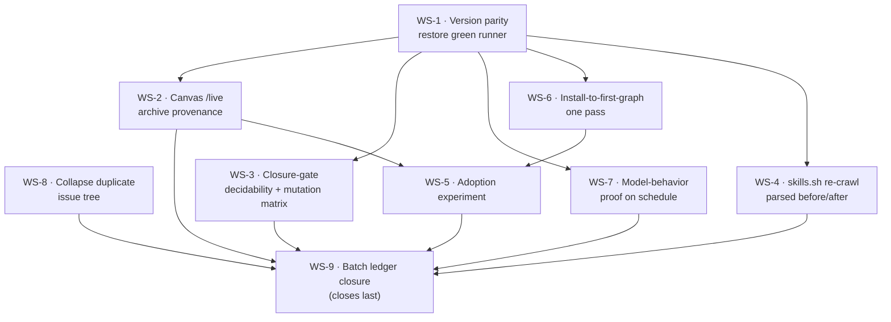

# Remediation Plan — Closing the Open Issue Backlog

> Produced by `/problem-based-srs functional-requirements` on 2026-09-30.
> Source signals: daily eval [#396](https://github.com/RafaelGorski/Problem-Based-SRS/issues/396),
> the 90 open issues, and a locally reproduced test run.

This plan turns the open backlog into **nine sequenced work-streams (WS-1 … WS-9)**, each
with functional requirements in canonical dotted notation, testable acceptance criteria, and
an explicit verification command — Playwright with PNG screenshots for the **canvas app**,
CLI for the **skills/methodology** side.

---

## 1. Measured starting state

Reproduced locally on 2026-09-30 (Node 25.8.2, PowerShell 7.6.6).

**As found:**

| Suite | Result | Counts |
|---|---|---:|
| Plugin validation | PASS | 1/1 |
| Canvas extension (`npm test`) | PASS | 307/307 |
| Deterministic skill evals | **FAIL** | **11 failures** |
| Playwright canvas + site e2e | **FAIL** | 40 pass / **1 fail** |
| Skill behavior (LLM) | SKIPPED | provider keys absent |
| **Overall** | **FAIL** | **1,287 / 1,299** |

**After this planning pass** (two root causes fixed in passing while verifying — see below):

| Suite | Result | Counts |
|---|---|---:|
| Plugin validation | PASS | 1/1 |
| Canvas extension | PASS | 307/307 |
| Deterministic skill evals | **FAIL** | **10 failures** |
| Playwright canvas + site e2e | **PASS** | **41/41** |
| **Overall** | **FAIL** | **1,289 / 1,299** |

### The failures reduce to six root causes

| # | Root cause | Evidence | Fails | Status |
|---|---|---|---:|---|
| RC-1 | `README.md:3` badge says `2.6.0`; manifest is `2.7.0` | `release-hygiene.test.mjs:273` | 1 | open |
| RC-2 | `docs/docs.html:13,22,530,540` says `2.6.0` | `docs-version-parity.test.mjs:39` | 1 | open |
| RC-3 | `CHANGELOG.md` has a `## [2.7.0]` section but **no** `[2.7.0]:` link definition | `release-hygiene.test.mjs:138,163,412` | 3 | open |
| RC-4 | Stale `v2.6` release fixtures now classify as `unknown` | `release-preflight.test.mjs:928`, `release-trains.test.mjs:427` | 2 | open |
| RC-5 | Canvas `package-lock.json` said `1.1.3`; `VERSION`/`package.json` say `1.1.5` | `dependency-pins.test.mjs:72` | 1 | ✅ **fixed** |
| RC-6 | `docs/skills-health.html` advertised `v2.6.0 · v1.1.3`, generated 2026-08-15 | `site.test.mjs:84` (Playwright) | 1 | ✅ **fixed** |

**RC-5 and RC-6 were resolved during verification**, by the ecosystem's own tools rather than by hand:

- `npm install` in the canvas extension rewrote `package-lock.json` to `1.1.5`, matching the `package.json` beside it. `dependency-pins.test.mjs` now passes 2/2.
- `run-tests.ps1 -NoOpen` regenerated `docs/skills-health.html` / `.json`, which now read `v2.7.0 · SRS Navigator v1.1.5` with a current timestamp. Playwright `site.test.mjs:84` now passes, taking the whole e2e suite to 41/41.

The regenerated dashboard also now reports `"state": "failed"` honestly, rather than the stale `"passed" / 1299 / 0 failures` snapshot from 2026-08-15 that contradicted the actual tree.

**All six root causes are metadata drift.** No product logic is broken. This is the cheapest
possible trust win and it gates everything else, because every other work-stream is verified
by a runner that is currently red.

### The backlog is 90 issues but ~9 problems

`gh api graphql` over all open issues shows **89 of 90 have a parent**; only #396 is a root.
The tree descends from *already-closed* roots (#136, #144, #210, #212 …), and issues
**#350–#395 are a single batch of 46 created on 2026-09-29**, each a Title-Cased restatement
of its own parent. Examples:

- #142 *"Run one external /live adoption experiment and record outcome"*
  → #389 *"[sub of #142] Run One External /live Adoption Experiment And Record The Outcome"*
- #140 → #173 → #190 → #353, all four specifying "capture the parsed registry before-state".
- #149 alone carries **11** sub-issues, six closed, all restating "close the batch on live evidence".

This is a runaway generator, and it is why the backlog looks unclosable. **WS-8 stops it.**
Creating one new sub-issue per open issue would have produced a fourth such batch; this plan
instead creates **one sub-issue per work-stream**, each naming the issues it subsumes.

---

## 2. Traceability chain

### Customer Problems

| ID | Problem |
|----|---------|
| **CP.01** | A skeptical brownfield engineer is asked to audit the anti-drift claim, but the audit fails and public version surfaces contradict each other — so the proof meant to earn trust destroys it. |
| **CP.02** | The public distribution surface (skills.sh) advertises eight skills the repository no longer ships, so discovery resolves to nothing. |
| **CP.03** | Nobody has observed a real engineer completing install → first traced spec → `/live`, so the funnel's drop-off point is unknown. |
| **CP.04** | The issue tracker has lost signal: 90 open issues encode ~9 problems, so maintainers cannot tell what is actually outstanding. |

### Customer Needs

| ID | Need | Addresses |
|----|------|-----------|
| **CN.01.1** | Every public version surface agrees with its manifest, and the default runner is green. | CP.01 |
| **CN.01.2** | `/live` provenance is provable from the *published* canvas archive, not the working tree. | CP.01 |
| **CN.01.3** | A release claim's closure gate is decidable by a command and required by the process. | CP.01 |
| **CN.01.4** | The anti-drift claim is exercised against real models, not only deterministic guards. | CP.01 |
| **CN.02.1** | The registry listing matches the shipped skill, verified by parsed content rather than exit code. | CP.02 |
| **CN.03.1** | An adoption experiment is pre-registered, run from published bytes, and its outcome recorded against a threshold fixed in advance. | CP.03 |
| **CN.03.2** | Install-to-first-graph runs in one pass on a clean machine, installing **both** surfaces. | CP.03 |
| **CN.04.1** | Duplicate issue subtrees are collapsed, and the generator that produced them cannot run again unchecked. | CP.04 |
| **CN.04.2** | The batch ledger closes only on re-derived membership and same-session green evidence. | CP.04 |

---

## 3. Execution sequence and dependencies



| Order | WS | Issue | Parent | Blocked by | Nature | Est. |
|------:|----|-------|--------|-----------|--------|------|
| 1 | **WS-1** Version parity → green runner | [#397](https://github.com/RafaelGorski/Problem-Based-SRS/issues/397) | #396 | — | Code | <1 day |
| 1 | **WS-8** Collapse duplicate issue tree | [#398](https://github.com/RafaelGorski/Problem-Based-SRS/issues/398) | #396 | — | Process | <1 day |
| 2 | **WS-2** Canvas `/live` archive provenance | [#399](https://github.com/RafaelGorski/Problem-Based-SRS/issues/399) | #138 | #397 | Code + evidence | 1 day |
| 2 | **WS-3** Closure-gate decidability | [#400](https://github.com/RafaelGorski/Problem-Based-SRS/issues/400) | #139 | #397 | Tooling | 1–2 days |
| 2 | **WS-7** Model-behavior proof on schedule | [#401](https://github.com/RafaelGorski/Problem-Based-SRS/issues/401) | #396 | #397 | CI | 1 day |
| 3 | **WS-6** Install-to-first-graph one pass | [#402](https://github.com/RafaelGorski/Problem-Based-SRS/issues/402) | #396 | #397 | Docs + test | 1 day |
| 3 | **WS-4** skills.sh re-crawl verification | [#403](https://github.com/RafaelGorski/Problem-Based-SRS/issues/403) | #140 | #397 | **External** (third-party crawl) | days–weeks |
| 4 | **WS-5** Adoption experiment | [#404](https://github.com/RafaelGorski/Problem-Based-SRS/issues/404) | #142 | #399, #402 | **External** (human participants) | 2–3 days + window |
| 5 | **WS-9** Batch ledger closure | [#405](https://github.com/RafaelGorski/Problem-Based-SRS/issues/405) | #149 | all above | Bookkeeping | <1 day |

**WS-4 and WS-5 cannot be completed by code.** WS-4 waits on skills.sh re-crawling the
repository; WS-5 waits on recruited participants. They are sequenced late and their
acceptance criteria are written so that *requesting and evidencing* the external step is the
deliverable, not controlling its outcome.

---

## 4. Functional requirements

### WS-1 — Restore version parity and a green runner

Subsumes: #313, #316, #346/#356, #374, #379 · Parent: **#396** · Tracked by: **#397**

#### FR.01.1.1: Manifest-derived version surfaces

**Traces to:** CN.01.1 → CP.01 · **Priority:** Must Have

> The build system shall present the plugin manifest version on every public plugin surface —
> `README.md`, `docs/index.html`, and `docs/docs.html` — with no surface naming a different version.

**Acceptance Criteria**
- [ ] `README.md:3` badge reads the manifest version (`2.7.0`), linking `/releases` (index, not a per-tag URL)
- [ ] `docs/docs.html` lines 13, 22, 530, 540 read `2.7.0`
- [ ] `node --test evals/tests/docs-version-parity.test.mjs` passes
- [ ] `node --test evals/tests/release-hygiene.test.mjs` passes

#### FR.01.1.2: Exactly one release link per changelog version

**Traces to:** CN.01.1 → CP.01 · **Priority:** Must Have

> The changelog shall give every released version exactly one reference definition naming the
> tag the plugin pipeline actually creates.

**Acceptance Criteria**
- [ ] `CHANGELOG.md` gains `[2.7.0]: …/releases/tag/v2.7` (normalized — trailing `.0` stripped)
- [ ] No changelog version has zero or duplicate link definitions
- [ ] `node --test evals/tests/release-hygiene.test.mjs evals/tests/distribution-drift.test.mjs` passes

#### FR.01.1.3: Canvas lockfile parity

**Traces to:** CN.01.1 → CP.01 · **Priority:** Must Have

> The canvas extension lockfile shall record the same version as the `package.json` beside it
> and the repository `VERSION` file.

**Acceptance Criteria**
- [x] `package-lock.json` `version` and `packages[""].version` both read `1.1.5` — **done**, via `npm install`
- [x] `node --test evals/tests/dependency-pins.test.mjs` passes — **done**, 2/2

#### FR.01.1.4: Train-resolvable release fixtures

**Traces to:** CN.01.3 → CP.01 · **Priority:** Must Have

> The release-train and preflight suites shall exercise tags that resolve to a known train
> against the versions currently on disk.

**Acceptance Criteria**
- [ ] No fixture hard-codes a tag that classifies as `unknown` (currently `v2.6`)
- [ ] Fixtures derive their tag from `plugin.json` / `VERSION` rather than restating a literal
- [ ] `node --test evals/tests/release-preflight.test.mjs evals/tests/release-trains.test.mjs` passes

#### FR.01.1.5: Regenerated health dashboard

**Traces to:** CN.01.1 → CP.01 · **Priority:** Must Have

> The published skills-health dashboard shall name the same plugin and canvas versions as the
> site badge, and shall report the current pass total.

**Acceptance Criteria**
- [x] `docs/skills-health.html` names `v2.7.0` and Navigator `v1.1.5` — **done**
- [x] Generation timestamp is from this remediation run, not 2026-08-15 — **done**
- [ ] Reported pass count equals the observed total with zero failures — blocked on RC-1…RC-4; the dashboard now honestly reports `failed · 1289/1299`
- [x] Playwright `site.test.mjs:84` passes — **done**, e2e now 41/41

**Verification — CLI**
```powershell
node --test evals/tests/dependency-pins.test.mjs evals/tests/distribution-drift.test.mjs `
  evals/tests/docs-version-parity.test.mjs evals/tests/release-hygiene.test.mjs `
  evals/tests/release-preflight.test.mjs evals/tests/release-trains.test.mjs
pwsh -File run-tests.ps1 -NoOpen      # expect 1299/1299, 0 failures
```

**Verification — Playwright with screenshots**
```powershell
Set-Location .github\extensions\srs-navigator
npx playwright test --reporter=line
```
Evidence PNGs (already emitted by the suite into `test-results/`):
`landing-version-badge.png`, `skills-health-dashboard.png`, `landing-health-link.png`.
Attach `landing-version-badge.png` and `skills-health-dashboard.png` to the issue — together
they show badge and dashboard naming the same version.

---

### WS-8 — Collapse the duplicate issue tree and stop the generator

Subsumes: #350–#395 (46 issues) · Parent: **#396** · Tracked by: **#398**

#### FR.04.1.1: Deduplicated backlog

**Traces to:** CN.04.1 → CP.04 · **Priority:** Must Have

> The maintainers shall close every sub-issue that restates its own parent without adding a
> distinct acceptance criterion, citing the parent it duplicates.

**Acceptance Criteria**
- [ ] Each of #350–#395 is either closed as duplicate (citing its parent) or given a criterion its parent lacks
- [ ] Open issue count falls from 90 to roughly the count of distinct work-streams
- [ ] No open issue's title is a case-variant restatement of its parent's title

#### FR.04.1.2: Generator guard

**Traces to:** CN.04.1 → CP.04 · **Priority:** Must Have

> The issue-creating automation shall refuse to open a sub-issue whose normalized title matches
> an existing open sibling or its parent.

**Acceptance Criteria**
- [ ] A guard rejects case-insensitive, punctuation-normalized title collisions against parent and open siblings
- [ ] A test in `evals/tests/` fails if the guard is removed or weakened
- [ ] Negative-tested: the guard demonstrably rejects the #142 → #389 pair

**Verification — CLI**
```powershell
gh api graphql -f query='query { repository(owner:"RafaelGorski", name:"Problem-Based-SRS") {
  issues(states:OPEN, first:100) { totalCount nodes { number title parent { number } } } } }'
node --test evals/tests/issue-ledger.test.mjs
```
Expect `totalCount` materially reduced and no title duplicating its parent.

---

### WS-2 — Canvas `/live` provenance from the published archive

Subsumes: #138, #162, #183, #306, #350, #357, #365, #371 · Parent: **#138** · Tracked by: **#399**

#### FR.01.2.1: Archive-derived `/live` rendering

**Traces to:** CN.01.2 → CP.01 · **Priority:** Must Have

> The canvas extension shall render the `/live` graph from the bytes of the published release
> archive, with no dependency on the working tree.

**Acceptance Criteria**
- [ ] `/live` renders from the downloaded `v1.1.5` archive on a clean profile
- [ ] Every release claim in #138's body names `v1.1.5` (the currently published version)
- [ ] Graph shows 29 nodes, 5 need clusters, 100% traceability, canonical dotted IDs
- [ ] Screenshot captured from the **archive-derived** canvas, not the repo checkout

**Verification — CLI + Playwright with screenshots**
```powershell
node --test evals/tests/from-archive-install.test.mjs evals/tests/archive-canvas-tool.test.mjs
Set-Location .github\extensions\srs-navigator
npx playwright test tests\visual.test.mjs --reporter=line
```
Attach `test-results/live-dotted-notation.png` — the full-page `/live` graph proving dotted
notation and the node/cluster counts.

---

### WS-3 — Make closure gating decidable and required

Subsumes: #139, #145, #164, #174, #182, #186, #194, #352, #358, #359, #366, #372, #375, #380 · Parent: **#139** · Tracked by: **#400**

#### FR.01.3.1: Deterministic release-claim classification

**Traces to:** CN.01.3 → CP.01 · **Priority:** Must Have

> The closure gate shall classify an issue's release claim as *claim*, *non-claim*, or
> *undecidable* by parsing its body, returning the same verdict for the same input every run.

**Acceptance Criteria**
- [ ] A command returns one of exactly three verdicts and a non-zero exit only on *undecidable*
- [ ] Re-running on unchanged input returns an identical verdict
- [ ] #139's own non-claim is recorded and classified

#### FR.01.3.2: Executed mutation matrix

**Traces to:** CN.01.3 → CP.01 · **Priority:** Must Have

> The closure gate shall be proven by a mutation matrix in which each mutation flips the
> verdict, demonstrating the gate is not vacuous.

**Acceptance Criteria**
- [ ] Each hardened mutation (open box without blocker, ticked box without citation, stale version claim) flips the verdict
- [ ] Matrix results recorded with the command and output that produced them
- [ ] The gate is a required step in the documented release process, not advisory

**Verification — CLI**
```powershell
node evals/tools/issue-ledger.mjs --issue 139
node --test evals/tests/issue-ledger.test.mjs
```

---

### WS-7 — Exercise the anti-drift claim against real models

Subsumes: #294, #355 · Parent: **#396** · Tracked by: **#401**

#### FR.01.4.1: Scheduled credentialed behavior run

**Traces to:** CN.01.4 → CP.01 · **Priority:** Should Have

> The repository shall run provider-backed skill-behavior checks on a scheduled protected
> workflow, reporting per-provider results without exposing secrets.

**Acceptance Criteria**
- [ ] A scheduled workflow runs `npm run test:skill-behavior` with provider credentials
- [ ] Missing-key **local** runs still skip cleanly — the default suite stays offline and deterministic
- [ ] Failure traces identify the provider and scenario without leaking key material
- [ ] At least one Discovery-Interview canary is exercised against a real model

**Verification — CLI**
```powershell
Set-Location .github\extensions\srs-navigator
npm run test:skill-behavior          # skips cleanly with no keys; runs with them
```

---

### WS-6 — Install-to-first-graph in one pass

Subsumes: #308, #377 · Parent: **#396** · Tracked by: **#402**

#### FR.03.2.1: Two-surface quick start

**Traces to:** CN.03.2 → CP.03 · **Priority:** Must Have

> The quick start shall install **both** the skill and the SRS Navigator canvas before it
> promises `/live`, and shall provide a verification step confirming both are available.

**Acceptance Criteria**
- [ ] `README.md` quick start installs skill **and** canvas on a Copilot-first path
- [ ] A verification step confirms `/problem-based-srs` and the `srs-navigator` canvas both resolve
- [ ] `docs/docs.html` install → run → `/live` path matches the README exactly
- [ ] The canvas README stops calling gist installation "recommended" while product surfaces recommend the repository-folder installer
- [ ] Executable in one pass on a clean machine with no undocumented prerequisite

**Verification — CLI + Playwright with screenshots**
```powershell
node --test evals/tests/skills-install.test.mjs evals/tests/landing-proof.test.mjs
Set-Location .github\extensions\srs-navigator
npx playwright test tests\site.test.mjs --reporter=line
```
Attach `test-results/landing-install.png` — the rendered install section a prospect sees.

---

### WS-4 — Verify the skills.sh re-crawl by parsed content

Subsumes: #140, #147, #173, #175, #190, #195, #301, #303, #304, #353, #360, #361, #362, #368, #369, #370, #373, #376, #381, #384 · Parent: **#140** · Tracked by: **#403**

> **External dependency.** skills.sh controls the crawl. The deliverable is the *chain of
> evidence*, in order — not a guaranteed listing change.

#### FR.02.1.1: Ordered before-state → request → after-state chain

**Traces to:** CN.02.1 → CP.02 · **Priority:** Must Have

> The maintainers shall capture the parsed registry before-state **prior to** submitting the
> re-crawl request, and verify the after-state by parsed content rather than exit code.

**Acceptance Criteria**
- [ ] Before-state captured and timestamped **before** the request (ordering is the point — a capture taken after proves nothing)
- [ ] Re-crawl request recorded with submission time
- [ ] After-state parsed and diffed against before-state; the diff is the evidence
- [ ] Both the eight stale names clearing **and** the surviving page's content being current are confirmed
- [ ] `registry-listing-unreadable` / `registry-skill-unreadable` warnings handled explicitly — an unreadable page is **not** counted as drift cleared
- [ ] `registry-skill-version-unverifiable` remains a `notice`; it must not gate closure

**Verification — CLI**
```powershell
node scripts/check-distribution.mjs                 # human-readable, always exits 0
node scripts/check-distribution.mjs --strict        # exit 1 on drift
node --test evals/tests/registry-listing-content.test.mjs evals/tests/distribution-drift.test.mjs
```
Expect `registry-listing-drift` absent **and** `registry-skill-stale` absent, with no
`*-unreadable` warning masking the result.

---

### WS-5 — Run one external `/live` adoption experiment

Subsumes: #142, #148, #178, #185, #188, #309, #310, #311, #312, #354, #363, #364, #382, #385, #386, #387, #388, #389 · Parent: **#142** · Tracked by: **#404**

> **External dependency.** Needs recruited participants. Pre-registration must land before the run.

#### FR.03.1.1: Pre-registered contract

**Traces to:** CN.03.1 → CP.03 · **Priority:** Must Have

> The maintainers shall pre-register the adoption threshold, observation window, and outcome
> rule **before** observing any participant.

**Acceptance Criteria**
- [ ] Threshold, window, and outcome rule committed with a timestamp preceding the first run
- [ ] The rule decides success/failure without post-hoc reinterpretation
- [ ] Recorded in `docs/adoption-experiment.md`

#### FR.03.1.2: Run from published bytes

**Traces to:** CN.03.1 → CP.03 · **Priority:** Must Have

> Participants shall install from the **published** release artifacts, not a working tree.

**Acceptance Criteria**
- [ ] Each participant installs from published plugin and canvas archives
- [ ] Time-to-install, time-to-first CP→CN→FR chain, `/live` success, and abandonment reason recorded
- [ ] Outcome filed against the pre-registered threshold, including a negative result if that is what occurred

**Verification — CLI + Playwright with screenshots**
```powershell
node --test evals/tests/from-archive-install.test.mjs
Set-Location .github\extensions\srs-navigator
npx playwright test tests\visual.test.mjs --grep "wow-moment" --reporter=line
```
Attach each participant's `/live` screenshot plus the suite's `live-dotted-notation.png` as
the reference rendering.

---

### WS-9 — Close the batch on re-derived, same-session evidence

Subsumes: #149, #179, #189, #198, #317, #318, #319, #367, #390, #391, #392, #393, #394, #395 · Parent: **#149** · Tracked by: **#405**

#### FR.04.2.1: Closure-time membership re-derivation

**Traces to:** CN.04.2 → CP.04 · **Priority:** Must Have

> The batch ledger shall re-derive its membership **at closure time** and reconcile every
> acceptance box before the batch is closed.

**Acceptance Criteria**
- [ ] Membership re-derived at closure, not reused from an earlier snapshot
- [ ] Every acceptance box is counted; open boxes carry a named blocker; ticked boxes carry a citation
- [ ] Ledger and runner are green **in the same session** — evidence from an earlier session does not count
- [ ] WS-9 closes **last**, after WS-1 … WS-8

**Verification — CLI**
```powershell
node evals/tools/issue-ledger.mjs --batch 149
node --test evals/tests/issue-ledger.test.mjs
pwsh -File run-tests.ps1 -NoOpen      # must be green in this same session
```

---

## 5. Non-functional requirements

### NFR.01: Default suite stays offline and deterministic

**Category:** Maintainability · **Applies to:** FR.01.1.1–FR.01.1.5, FR.01.4.1

> The default test runner shall complete without network access or provider credentials.

- **Target:** `pwsh -File run-tests.ps1 -NoOpen` green offline; LLM suites skip cleanly
- **Method:** run with credentials unset and network disabled
- [ ] Anything needing an LLM or credentials sits behind `npm run test:skill-behavior`

### NFR.02: Every behavior change ships a drift guard

**Category:** Maintainability · **Applies to:** all FRs

> Each change to skill behavior, canvas logic, or the sync mechanism shall ship a test that
> fails if the behavior regresses.

- **Target:** 100% of behavior changes carry a guard
- **Method:** negative-test — mutate the source, confirm the test fails, restore
- [ ] Bundled canvas skills re-synced via `node scripts/sync-skills.mjs`
- [ ] Byte-for-byte sync asserted between canonical and bundled copies

### NFR.03: External-dependency work-streams are evidenced, not assumed

**Category:** Reliability · **Applies to:** FR.02.1.1, FR.03.1.1, FR.03.1.2

> Work-streams gated on third parties shall be closed on recorded evidence of the request and
> its parsed outcome, never on elapsed time or a zero exit code.

- **Target:** zero closures justified by exit code alone
- **Method:** each closure cites a parsed before/after diff or a recorded participant outcome
- [ ] An unreadable surface is reported as unreadable, never as drift cleared

---

## 6. Verification matrix

| WS | Canvas app — Playwright + PNG | Skills/CLI |
|----|-------------------------------|------------|
| WS-1 | `npx playwright test` → `landing-version-badge.png`, `skills-health-dashboard.png` | `run-tests.ps1 -NoOpen` → 1299/1299 |
| WS-2 | `visual.test.mjs` → `live-dotted-notation.png` (archive-derived) | `from-archive-install.test.mjs` |
| WS-3 | — | `issue-ledger.mjs --issue 139` + mutation matrix |
| WS-4 | — | `check-distribution.mjs --strict` |
| WS-5 | participant `/live` captures + `live-dotted-notation.png` | `from-archive-install.test.mjs` |
| WS-6 | `site.test.mjs` → `landing-install.png` | `skills-install.test.mjs` |
| WS-7 | — | `npm run test:skill-behavior` |
| WS-8 | — | `gh api graphql` open-issue census |
| WS-9 | — | `issue-ledger.mjs --batch 149` + green runner, same session |

Screenshots land in `.github/extensions/srs-navigator/test-results/`, which is git-ignored —
attach them to the GitHub issue rather than committing them.

---

## 7. Definition of done

1. `pwsh -File run-tests.ps1 -NoOpen` reports **1,299 / 1,299**, zero failures.
2. No public surface names a version other than its manifest's.
3. `node scripts/check-distribution.mjs --strict` exits 0, with no `*-unreadable` warning masking it.
4. Open issue count reflects distinct work, with no title restating its parent.
5. Every closed issue cites the command and artifact that proved it — screenshot for the app, CLI output for the skills.
6. WS-9 closes last, on a same-session green ledger and green runner.
