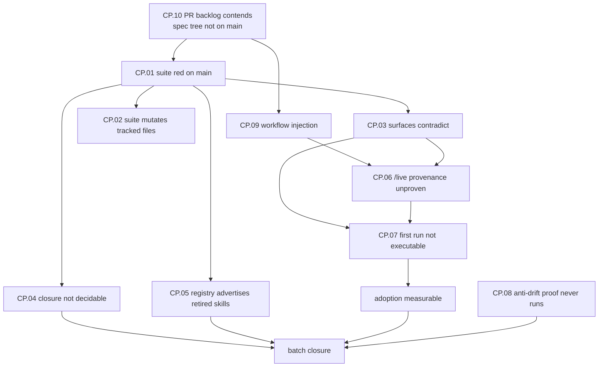

# Customer Problems — Open-Issue Resolution

> **Step 1 of the Problem-Based SRS methodology.**
> Scope: the 93 open issues on `RafaelGorski/Problem-Based-SRS` as of **2026-09-23**.
> Every problem below is stated from a **measurement taken on this worktree**, not from a
> restatement of an existing issue. The command and its result are cited inline.

## Measurement baseline

| Fact | Command | Result |
|---|---|---|
| HEAD | `git log --oneline -1` | `c5735ed` Prepare v2.7.0 release |
| Default suite | `pwsh -File run-tests.ps1 -NoOpen` | **exit 1** — 1287/1299, **12 failures** |
| Tracked-state mutation | `git status --porcelain` after the run | **3 tracked files modified** |
| Cited spec tree | `git ls-tree -r --name-only origin/main -- docs/spec` | **empty — the path is not on `main`** |
| Open issues | `gh issue list --state open --limit 200` | **93** |
| Open PRs | `gh pr list --state open` | **6** — #181, #199, #206, #215, #276, #277 |

### The shape of the backlog

93 open issues resolve to **~11 distinct engineering themes**. The remainder are four
generations of nested restatement:

```
#138 #139 #140 #142 #145 #147 #148 #149      gen 1 — eight roots
  └─ #162 #164 #165 #173 #174 #175 #176 …    gen 2 — "[sub of #N]"
      └─ #207 #209 #210 … #226               gen 3 — subs of (closed) #216
          └─ #230 … #274                     gen 4 — subs of gen 2/3
```

Issue #209 records the consequence precisely: across this batch, over a full month,
**323 acceptance boxes moved from 0 checked to 0 checked.**

---

## CP.01 — The repository's own default suite fails on `main`

**Problem statement:** A maintainer cannot satisfy any acceptance criterion phrased
"the suite passes", because the suite does not pass from a clean checkout of `main`.

**Evidence (2026-09-23):** `pwsh -File run-tests.ps1 -NoOpen` exits 1 with 12 failures —
11 in `evals`, 1 in the Playwright `site` project. The failures are not twelve defects;
they are **three**:

| Class | Failing tests | Root cause |
|---|---|---|
| Lockfile skew | 2 | `package.json` reads `1.1.4`, `package-lock.json` reads `1.1.3` |
| Release/version parity | 9 | `README.md`/`docs/*.html`/`CHANGELOG.md` still advertise `2.6.0`; manifest is `2.7.0` |
| Stale build artefact | 1 | committed `docs/skills-health.html` reports a generation date from 2026-08-15 |

**Impact:** Every downstream issue in the batch inherits an unsatisfiable gate. This is
the single cheapest blocker in the backlog and it gates nine of the eleven workstreams.

**Stakeholders:** Maintainer, contributor, CI.

---

## CP.02 — Running the test suite rewrites tracked files

**Problem statement:** The act of measuring the repository changes it, so a contributor
cannot distinguish their own edits from runner output, and "the working tree is clean"
is not a checkable statement after a verification run.

**Evidence (2026-09-23):** after `run-tests.ps1 -NoOpen`, `git status --porcelain` reports:

```
 M .github/extensions/srs-navigator/package-lock.json
 M docs/skills-health.html
 M docs/skills-health.json
```

The lockfile mutation also **masks CP.01's first failure class**: the two lockfile tests
pass on a second run purely because the first run silently repaired the file.

**Impact:** Verification evidence is not reproducible, and a green second run is not proof
of a green first run.

**Stakeholders:** Contributor, reviewer, CI.

---

## CP.03 — Public surfaces advertise superseded and mutually contradictory facts

**Problem statement:** A prospective adopter reading the public surfaces cannot determine
what version they are installing, how many skills they are getting, or how large the demo
graph is, because the surfaces disagree with the manifest and with each other.

**Evidence (2026-09-23):**

- `README.md:3` and `docs/docs.html:13-22` advertise **2.6.0**; `v2.7` is published.
- `README.md` claims **"Ten AgentSkills"**; `build-plugin.py validate` prints
  `success: 1 skills validated`. The nine-to-one consolidation landed in #50; the prose
  never followed.
- `docs/index.html:103-168` states **28 nodes**; line 330 states **29**.
- `CHANGELOG.md:592` links `v2.6` for a section the manifest has already moved past.

**Impact:** The first thing an evaluator checks is whether the project's own claims are
internally consistent. Here they are not, and the discrepancy is visible without installing
anything.

**Stakeholders:** Prospective adopter, evaluator.

---

## CP.04 — Closure evidence is not machine-decidable

**Problem statement:** Issues in this batch close on assertions that no artifact supports,
because the closure gate cannot render a determinate verdict over the issues it governs.

**Evidence:** `node evals/tools/closure-evidence.mjs --prospective 138 139` exits 1 with
`#139 release-claim-indeterminate` (recorded in #209). #182 records a **duplicate**
release-claim marker on #139. #209 further records that #193, #196 and #197 were closed as
`COMPLETED` **within 8 seconds of each other** with **0 of 26** acceptance boxes ticked,
20 of them carrying no blocker — while their parents (#165, #176, #178) remain open.

**Impact:** This is the batch's own thesis demonstrated rather than argued: work is
declared finished on claims no artifact supports. Until the gate is decidable *and proven
to fail for the right reason*, closing anything in the batch is unfalsifiable.

**Stakeholders:** Maintainer, reviewer, release manager.

---

## CP.05 — The external skills.sh listing advertises skills the repository does not ship

**Problem statement:** A user who discovers the project through skills.sh is shown eight
skills that no longer exist, so discovery leads to an install that cannot match the listing.

**Evidence (2026-09-23):** `node scripts/check-distribution.mjs --strict` reports
`registry-listing-drift` with **8 phantom skills**. The listing is a cached third-party
index; the #50 consolidation never propagated. The scheduled distribution monitor run is red.

**Impact:** The surface with the highest discovery leverage is the one most out of date,
and it cannot be fixed by a pull request — only by a re-crawl request and *verified* by
parsed content, not by exit code.

**Stakeholders:** Prospective adopter, maintainer.

---

## CP.06 — `/live` provenance is demonstrated from the working tree, not the published artifact

**Problem statement:** Every `/live` demonstration to date renders from the developer's
checkout, so the artifact users actually download has never been shown to work.

**Evidence:** #219 records that existing capture is "a procedure control only; it cannot
satisfy provenance." #138's objective requires "archive-derived `/live` provenance for the
current published canvas release." No evidence in the batch derives from a downloaded
release asset.

**Impact:** The product's central demonstration is unproven for the bytes that ship. A
packaging regression would be invisible to every test currently run.

**Stakeholders:** Prospective adopter, release manager.

---

## CP.07 — The documented install-to-first-graph path is not executable in one pass

**Problem statement:** A new user following the documentation cannot reach a rendered graph,
because the two surfaces that describe the first run disagree about what must be installed.

**Evidence:** `docs/docs.html:106-126` presents `/live` after **only** the skills install,
while `README.md:300-326` requires the canvas extension to be installed **separately**.
Following the first surface produces a command that cannot work.

**Impact:** Activation fails at the exact step where the product is supposed to prove itself.
No adoption measurement is meaningful until this recipe executes.

**Stakeholders:** New user, prospective adopter.

---

## CP.08 — The model-specific anti-drift guardrail is claimed but never exercised

**Problem statement:** `README.md:20-27` advertises AI-slop prevention tuned to the model,
but the scheduled proof of that claim has not executed a single scenario in six runs.

**Evidence:** Six consecutive scheduled `skill-behavior.yml` runs failed because provider
credentials are absent; the latest is
[run 34836402372](https://github.com/RafaelGorski/Problem-Based-SRS/actions/runs/34836402372).
Local provider-gated checks skip for the same reason. `run-tests.ps1` reports
`Skill behavior (LLM) — SKIPPED`.

**Impact:** The differentiator the product leads with is the one claim with no live evidence
behind it. A skipped suite is indistinguishable from an absent one.

**Stakeholders:** Evaluator, maintainer.

---

## CP.09 — Release workflows interpolate untrusted ref names directly into shell

**Problem statement:** Four workflows holding `contents: write`, `issues: write` and
`actions: write` expand `${{ github.ref_name }}` inside a `run:` block, so a ref name
containing shell metacharacters is evaluated before any validation runs.

**Evidence:** #275, confirmed against `create-release.yml`, `release-canvas.yml`,
`thursday-release-report.yml`, `thursday-release.yml`. Severity HIGH, confidence 9/10.
Two LOW hygiene items accompany it: the lockfile skew of CP.01, and Actions pinned to
mutable major tags rather than commit SHAs.

**Impact:** Command substitution in an elevated-permission job is a repository-takeover
primitive, and it sits in the workflows that publish releases.

**Stakeholders:** Maintainer, every downstream consumer of a published release.

---

## CP.10 — Six open pull requests contend for the same files, and the cited spec tree is on none that merged

**Problem statement:** Seventeen issues cite `docs/spec/**` as their starting point. That
path is not on `main`. It exists in **two** competing open PRs, and two further PRs edit the
same workflow and lockfile as each other.

**Evidence (2026-09-23):**

| PR | State | Overlap |
|---|---|---|
| #199 | open, 2026-08-16 | adds `docs/spec/**` FR files |
| #215 | open, 2026-09-19 | adds **the same** `docs/spec/**` FR files, plus site copy |
| #276 | open, 2026-09-21 | workflow injection fix + SHA pinning + lockfile |
| #277 | draft, 2026-09-21 | **same 4 workflows + same lockfile**, plus version parity and a11y |
| #206 | open | supersedes part of #215's script change |
| #181 | draft | **0 files changed** — an empty placeholder |

**Impact:** Every leaf issue's first step is to read a file that is not there, and the two
PRs that would land it conflict with each other. Merging #276 and #277 in either order
produces a conflict in four workflow files. This is the batch's true entry point: it is not
that the work is undone, it is that finished work never landed and now contends with itself.

**Stakeholders:** Maintainer, reviewer, every issue in the batch.

---

## Problem dependency map



---

*Created: 2026-09-23*
*Produced by `/problem-based-srs functional-requirements` — Step 1 restated from live measurement.*
