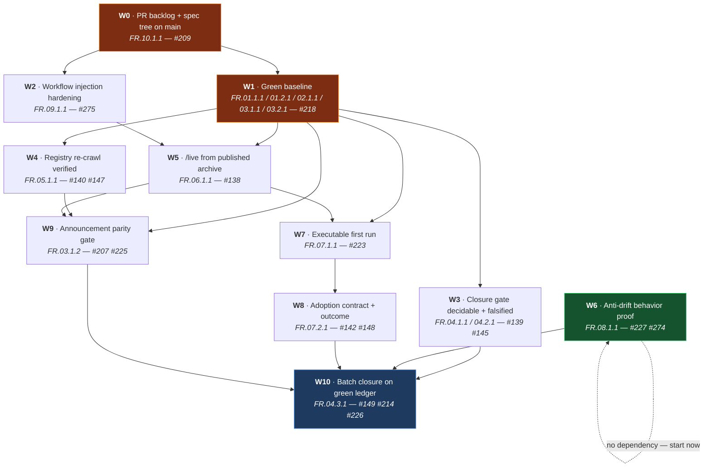

# Open-Issue Resolution Plan

> **Repository:** `RafaelGorski/Problem-Based-SRS`
> **Measured:** 2026-09-23, HEAD `c5735ed`
> **Method:** `/problem-based-srs functional-requirements`
> **Artifacts:** [`01-customer-problems.md`](01-customer-problems.md) →
> [`03-customer-needs.md`](03-customer-needs.md) →
> [`functional-requirements/_index.md`](functional-requirements/_index.md)

---

## Executive summary

**93 open issues. ~11 real engineering workstreams. 12 failing tests, which are 3 defects.**

The backlog is not 93 problems. It is four generations of nested restatement over eight
original roots, and issue #209 records the consequence exactly: across a full month,
**323 acceptance boxes moved from 0 checked to 0 checked.**

The reason nothing moved is measurable and is not a matter of effort. Seventeen issues cite
`docs/spec/**` as their starting point; **that path is not on `main`.** It exists in two
competing open pull requests. Every leaf issue's first step is to read a file that is not
there.

So the plan opens with the one action nothing else depends on: **land the work that already
exists.**

### What is actually broken

| # | Defect | Failing tests | Workstream |
|---|---|---|---|
| 1 | Lockfile skew `1.1.3` ≠ `1.1.4` | 2 | W1 |
| 2 | Version/release-link parity — surfaces still at `2.6.0` | 9 | W1 |
| 3 | Stale committed dashboard artefact | 1 | W1 |
| 4 | `${{ github.ref_name }}` interpolated into `run:` in 4 write-permission workflows | — | W2 |
| 5 | Closure gate returns `indeterminate`, so nothing in the batch is decidable | — | W3 |
| 6 | skills.sh lists 8 skills that no longer exist | — | W4 |
| 7 | `/live` has only ever been proven from the working tree | — | W5 |
| 8 | Anti-drift proof: 6 consecutive runs, 0 scenarios executed | — | W6 |
| 9 | `docs.html` omits the canvas install, so the first run cannot work | — | W7 |

---

## Dependency graph



**W6 has no predecessor.** It is a repository secret and a workflow dispatch, scored
RICE 5.0 at under an hour — the highest ratio in the backlog. Start it on day one, in
parallel with W0, and do not let it queue behind the foundation work.

---

## Tracking issues

Eleven sub-issues were opened on **2026-09-23**, one per workstream. Each links its parent
through GitHub's **native sub-issue API**, so `gh api repos/…/issues/<parent>/sub_issues`
resolves it — unlike the existing 93, which rely on the `[sub of #N]` title convention and
are invisible to that endpoint.

| Phase | WS | Sub-issue | Parent | Title |
|---|---|---|---|---|
| 0 | **W0** | [#278](https://github.com/RafaelGorski/Problem-Based-SRS/issues/278) | #209 | Reconcile the PR backlog and land the cited specification tree on main |
| 1 | **W1** | [#279](https://github.com/RafaelGorski/Problem-Based-SRS/issues/279) | #218 | Restore a green, non-mutating baseline on main |
| 1 | **W2** | [#280](https://github.com/RafaelGorski/Problem-Based-SRS/issues/280) | #275 | Harden release workflows against ref-name injection |
| 1 | **W6** | [#284](https://github.com/RafaelGorski/Problem-Based-SRS/issues/284) | #227 | Restore the scheduled anti-drift behavior proof *(no dependency — start now)* |
| 2 | **W3** | [#281](https://github.com/RafaelGorski/Problem-Based-SRS/issues/281) | #139 | Make the closure gate decidable, then falsify it |
| 2 | **W4** | [#282](https://github.com/RafaelGorski/Problem-Based-SRS/issues/282) | #140 | Verify the skills.sh re-crawl by parsed content |
| 2 | **W5** | [#283](https://github.com/RafaelGorski/Problem-Based-SRS/issues/283) | #138 | Render `/live` from the published canvas archive |
| 3 | **W7** | [#285](https://github.com/RafaelGorski/Problem-Based-SRS/issues/285) | #223 | Make install-to-first-graph executable in one pass |
| 3 | **W8** | [#286](https://github.com/RafaelGorski/Problem-Based-SRS/issues/286) | #142 | Pre-register the adoption contract and record a participant outcome |
| 4 | **W9** | [#287](https://github.com/RafaelGorski/Problem-Based-SRS/issues/287) | #207 | Gate the release announcement on live surface parity |
| 4 | **W10** | [#288](https://github.com/RafaelGorski/Problem-Based-SRS/issues/288) | #149 | Close the batch on a re-derived green ledger |

---

## Execution sequence

### Phase 0 — Foundation *(blocks everything)*

**W0 · FR.10.1.1 — Reconcile the PR backlog, land the cited spec tree**

Six open PRs, and they contend:

| Pair | Files in common | Decision |
|---|---|---|
| #199 ↔ #215 | the same `docs/spec/**` FR files | land one, close the other with a reason |
| #276 ↔ #277 | 4 workflow files **and** the lockfile | land one; merging both conflicts in all four |
| #206 ↔ #215 | `live-copy-edit-agent.mjs` | #206 is narrower — sequence first |
| #181 | **0 files** | close as superseded |

Also reopen or explicitly supersede #193, #196, #197 — closed `COMPLETED` within 8 seconds
of each other with 0 of 26 boxes ticked. Closing them silently is the behaviour this batch
exists to correct.

**Gate:** `git ls-tree -r --name-only origin/main -- docs/spec` returns a non-empty tree.

---

### Phase 1 — Green baseline *(parallel: W1 and W2; W6 already running)*

**W1 · FR.01.1.1, FR.01.2.1, FR.02.1.1, FR.03.1.1, FR.03.2.1 — #218**

Twelve failures, three defects. Fix in this order, because the first masks the second:

1. **Lockfile** — `npm install --package-lock-only`; diff must touch only version fields.
2. **Tracked-state mutation** — stop the suite rewriting `package-lock.json`,
   `docs/skills-health.html`, `docs/skills-health.json`. *Until this is done, a green second
   run is not evidence of a green first run.*
3. **Version parity** — fold the stranded `## [2.6.0]` changelog section into the manifest
   version's section. Do **not** try to cut `v2.6` from `main`; `build-plugin.py` validates
   the tag against `plugin.json` and will refuse.
4. **Surface facts** — `2.6.0` → manifest version; "Ten AgentSkills" → the count
   `validate` prints (one, since #50); 28 nodes → 29.
5. **Skip-link contrast** — `--ink-heading` (2.39:1) → `--on-primary` (7.50:1).

**W2 · FR.09.1.1 — #275** runs alongside. Pass `github.ref_name` through `env:` in all four
workflows; resync the lockfile; decide on SHA pinning. **Negative-test the guard** —
reintroduce an interpolation and confirm the test fails.

**Gate:** `run-tests.ps1 -NoOpen` exits 0 from a fresh clone, and `git status --porcelain`
is empty afterwards.

---

### Phase 2 — Evidence integrity *(W3, W4, W5 in parallel)*

- **W3 · FR.04.1.1 → FR.04.2.1.** Make the gate decidable first (#139 carries a duplicate
  marker; verify `train=none` actually parses), then falsify it against committed fixtures.
  `indeterminate` is not a valid failure result.
- **W4 · FR.05.1.1.** Capture the parsed before-state **before** requesting the re-crawl.
  Matching entry names is the cheap half; `registry-skill-stale` is the half that proves the
  re-crawl republished current content.
- **W5 · FR.06.1.1.** Download the canvas asset into a directory with no checkout, and render
  `/live` from those bytes. Read the release tag from live state at execution time.

---

### Phase 3 — Adoption *(sequential: W7 → W8)*

- **W7 · FR.07.1.1.** One recipe, both installs, a success check, timed on a clean profile.
- **W8 · FR.07.2.1.** Freeze the contract **before** the window opens; record a
  participant-originated outcome. Maintainer replay is not participant evidence.

---

### Phase 4 — Publication and closure

- **W9 · FR.03.1.2.** Read both release trains live, immediately before publishing. An
  announcement is the only irreversible action here.
- **W10 · FR.04.3.1.** Re-derive membership on the closing day; the ledger must exit 0.
  Close restatements as **duplicate**, citing the workstream that carries the work.

---

## Verification contract

Every workstream carries both tracks except where a track would be evidence for the wrong
claim — which is itself a finding, stated explicitly in each FR rather than omitted.

### Skills track — CLI

```bash
pwsh -File run-tests.ps1 -NoOpen             # the whole-repository gate
python scripts/build-plugin.py validate      # manifest + skills
node scripts/check-distribution.mjs --strict # published surfaces
node evals/tools/issue-ledger.mjs <issues>   # acceptance-box accounting
node evals/tools/closure-evidence.mjs --prospective <roots>
```

### App track — Playwright with screenshots

```bash
cd .github/extensions/srs-navigator
npx playwright test --project=site           # docs surfaces
npx playwright test --project=canvas         # the /live graph
```

Capture each screenshot **inside the assertion it supports**, so the image is written at the
moment the expectation is evaluated:

```js
await page.screenshot({ path: 'test-results/w1-site-version-badge.png' });
```

A screenshot taken during a separate later navigation proves the page was in that state at
some point — not that the assertion passed.

### Screenshot ledger

| File | Workstream | Proves |
|---|---|---|
| `w1-dashboard-version.png` | W1 | The dashboard names the manifest version |
| `w1-site-version-badge.png` | W1 | The badge shows the manifest version |
| `w1-site-skill-count.png` | W1 | The skill count matches `validate` |
| `w1-site-node-count.png` | W1 | Both node-count statements agree |
| `w1-skills-health-fresh.png` | W1 | The dashboard is from the current run |
| `w1-skip-link-focused.png` | W1 | The skip link at corrected contrast, focused via `Tab` |
| `w4-registry-before.png` / `-after.png` | W4 | The third-party listing before and after the re-crawl |
| `w4-skill-page-notation.png` | W4 | Canonical dotted IDs, not `FR-001` |
| `w5-live-from-archive.png` | W5 | `/live` rendered from the downloaded asset |
| `w5-archive-provenance.png` | W5 | The extraction directory — no checkout present |
| `w6-skipped-is-unproven.png` | W6 | A skipped suite renders as unproven, not green |
| `w7-first-live-graph.png` | W7 | First `/live` on a clean profile, with elapsed time |
| `w8-participant-first-graph.png` | W8 | The participant's own graph, from their machine |
| `w9-landing-parity.png` | W9 | Landing page and both release pages agree |
| `w10-green-dashboard.png` | W10 | The green run that closed the batch |

---

## Disposition of all 93 open issues

| Disposition | Count (approx.) | Rule |
|---|---|---|
| Carried by a workstream sub-issue | ~30 | The parents named in `functional-requirements/_index.md` and their direct children |
| Closed as **duplicate** | ~55 | Gen-2 to gen-4 restatements (#162–#198, #230–#274), each citing the workstream issue that carries its work |
| Closed as **superseded** | 4 | #181 (0 files), #193, #196, #197 |
| Remain open with a **named blocker** | as measured | Anything whose evidence genuinely has not been produced |

Closing a restatement as duplicate is not a shortcut. It is the correct disposition, and it
is the only action that reduces 93 issues to 11 without discarding a single piece of work.

---

## A note on this plan's own method

This plan does not create one sub-issue per open issue. Doing so would add 93 more issues to
a backlog whose defining pathology is nested restatement — committing the failure in the act
of correcting it, which is precisely what #209 documents about its predecessors.

It creates **one sub-issue per workstream**, each linked to its root parent, each naming the
duplicates it subsumes, and each carrying acceptance criteria that cannot be ticked without
a cited command output or commit SHA.

---

*Created: 2026-09-23 · `/problem-based-srs functional-requirements`*
*Traceability: CP.01–CP.10 → CN.01.1–CN.10.1 → FR.01.1.1–FR.10.1.1 + NFR.01–NFR.04*
