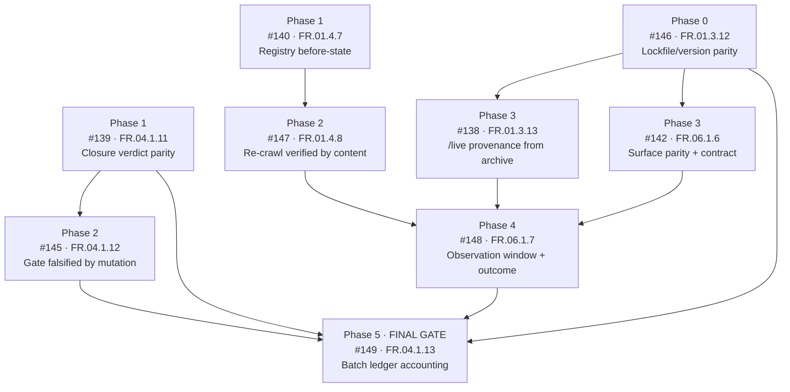

# Remediation plan — the nine open parent issues

**Produced:** 2026-08-15
**Method:** Problem-Based SRS, Step 5 (`/problem-based-srs functional-requirements`)
**Scope:** the nine open parent issues #138, #139, #140, #142, #145, #146, #147, #148, #149.
The twelve sub-issues filed on 2026-08-07 (#156–#167) and the two report issues (#168, #170) are
inputs to this plan, not targets of it.

> Every figure in this plan and in the requirement files was produced by **executing the
> repository's own tooling on 2026-08-15**, not by reading the issues. Where the live state
> contradicts what an issue asserts, the live state is recorded and the contradiction is named.

---

## Sub-issues filed

Nine sub-issues were created on **2026-08-15**, one per open parent, each linked to its parent
through GitHub's **native sub-issue** relationship (not only by title convention). Each carries the
"Problems found", acceptance criteria and both verification tracks from its requirement file.

| Phase | Parent | Sub-issue | Requirement | Focus |
|-------|--------|-----------|-------------|-------|
| 0 | [#146](https://github.com/RafaelGorski/Problem-Based-SRS/issues/146) | [#171](https://github.com/RafaelGorski/Problem-Based-SRS/issues/171) | [FR.01.3.12](functional-requirements/FR.01.3.12-canvas-lockfile-version-parity.md) | Stamp the lockfile in the bump; restore the consolidated gate |
| 1 | [#139](https://github.com/RafaelGorski/Problem-Based-SRS/issues/139) | [#172](https://github.com/RafaelGorski/Problem-Based-SRS/issues/172) | [FR.04.1.11](functional-requirements/FR.04.1.11-closure-verdict-parity.md) | Make audit and prospective agree; refuse a vacuous green |
| 1 | [#140](https://github.com/RafaelGorski/Problem-Based-SRS/issues/140) | [#173](https://github.com/RafaelGorski/Problem-Based-SRS/issues/173) | [FR.01.4.7](functional-requirements/FR.01.4.7-registry-before-state-capture.md) | Capture the registry before-state; submit the re-crawl |
| 2 | [#145](https://github.com/RafaelGorski/Problem-Based-SRS/issues/145) | [#174](https://github.com/RafaelGorski/Problem-Based-SRS/issues/174) | [FR.04.1.12](functional-requirements/FR.04.1.12-closure-gate-mutation-falsification.md) | Falsify the hardened gate under mutation |
| 2 | [#147](https://github.com/RafaelGorski/Problem-Based-SRS/issues/147) | [#175](https://github.com/RafaelGorski/Problem-Based-SRS/issues/175) | [FR.01.4.8](functional-requirements/FR.01.4.8-recrawl-content-verification.md) | Verify the re-crawl by parsed-content diff |
| 3 | [#138](https://github.com/RafaelGorski/Problem-Based-SRS/issues/138) | [#176](https://github.com/RafaelGorski/Problem-Based-SRS/issues/176) | [FR.01.3.13](functional-requirements/FR.01.3.13-live-provenance-published-archive.md) | Restate to the current release; capture `/live` provenance |
| 3 | [#142](https://github.com/RafaelGorski/Problem-Based-SRS/issues/142) | [#177](https://github.com/RafaelGorski/Problem-Based-SRS/issues/177) | [FR.06.1.6](functional-requirements/FR.06.1.6-adoption-surface-version-parity.md) | Fix the docs version contradiction; predeclare the contract |
| 4 | [#148](https://github.com/RafaelGorski/Problem-Based-SRS/issues/148) | [#178](https://github.com/RafaelGorski/Problem-Based-SRS/issues/178) | [FR.06.1.7](functional-requirements/FR.06.1.7-adoption-observation-outcome.md) | Run the window from published bytes; file the outcome |
| 5 | [#149](https://github.com/RafaelGorski/Problem-Based-SRS/issues/149) | [#179](https://github.com/RafaelGorski/Problem-Based-SRS/issues/179) | [FR.04.1.13](functional-requirements/FR.04.1.13-batch-ledger-accounting.md) | Account for every box; close in dependency order |

None of the nine sub-issues carries a `release-claim` marker. Each states instead that it claims no
release of its own — remediation work should not assert releases it does not own, and a marker added
for tidiness would perturb the very gate that [FR.04.1.11](functional-requirements/FR.04.1.11-closure-verdict-parity.md)
is trying to make trustworthy.

---

## What changed since the last round

The single most important finding is that **the batch's central blocker has cleared and nobody
recorded it**.

| Assertion in the 2026-08-07 issues | State on 2026-08-15 |
|---|---|
| canvas `v1.1.1` is unpublished; #138/#146 are blocked | **Published 2026-08-07**, superseded by `v1.1.2` and `v1.1.3` on 2026-08-13 |
| `closure-evidence.mjs --prospective 138 146` → exit 1 with a named blocker | **exit 0** — both are decidable and unblocked |
| the batch is waiting on a release | the batch is waiting on **nobody having looked** |

Two issues (#138, #146) are ready to progress and read as stalled. Meanwhile the ledger reports
**58 boxes, 0 checked, 57 open-without-blocker, 7 superseded-version-mentions** across the batch.

Three defects were found that **no open issue currently owns**:

1. **The consolidated suite is red.** `dependency-pins.test.mjs` fails: `package-lock.json` says
   `1.1.0`, `VERSION` and `package.json` say `1.1.3`. Four requirements name a green suite as a
   closure condition, so this one failure makes all four unsatisfiable.
2. **The closure gate is vacuously green in audit mode.** All nine issues return exit `0` —
   *"Every checked release claim has a matching published release"* — over a set of **zero checked
   claims**. The same nine under `--prospective` return exit `1` with seven indeterminate findings.
   The two modes disagree on identical input.
3. **The documentation site contradicts itself.** `docs/docs.html` advertises **v2.4.1** (badge and
   footer) while `docs/index.html` advertises **v2.6.0**; the published plugin release is **v2.6**.

---

## Dependency graph

**Critical path:** #146 → #142 → #148 → #149 (four phases).
**Parallel track:** #139 → #145 and #140 → #147 can run alongside from day one.

---

## The sequence

### Phase 0 — unblock everything · [#146](https://github.com/RafaelGorski/Problem-Based-SRS/issues/146) · [FR.01.3.12](functional-requirements/FR.01.3.12-canvas-lockfile-version-parity.md)

Make the bump stamp `package-lock.json` alongside `VERSION` and `package.json`, and add the
regression assertion. **Nothing else in the batch can legitimately close until the suite can exit
zero**, so this is first regardless of its size.

*Depends on:* nothing. *Blocks:* #138, #142, #149.

### Phase 1 — two independent starts

**[#139](https://github.com/RafaelGorski/Problem-Based-SRS/issues/139) · [FR.04.1.11](functional-requirements/FR.04.1.11-closure-verdict-parity.md)** — make audit and prospective
mode return the same verdict, treat indeterminate as indeterminate in both, and refuse a clean
verdict for an empty ledger. Until this lands, every "the gate is clean" statement in the batch is
unreliable.

**[#140](https://github.com/RafaelGorski/Problem-Based-SRS/issues/140) · [FR.01.4.7](functional-requirements/FR.01.4.7-registry-before-state-capture.md)** — capture the registry
before-state (parsed entries *and* parsed page content) and submit the re-crawl. Third-party state
with a crawl delay: start it early so the waiting overlaps other work.

*Both depend on:* nothing.

### Phase 2 — prove the fixes

**[#145](https://github.com/RafaelGorski/Problem-Based-SRS/issues/145) · [FR.04.1.12](functional-requirements/FR.04.1.12-closure-gate-mutation-falsification.md)** — falsify the
**hardened** gate under mutation and attach the failing transcript. Running this before Phase 1
would document behaviour that is about to change.

**[#147](https://github.com/RafaelGorski/Problem-Based-SRS/issues/147) · [FR.01.4.8](functional-requirements/FR.01.4.8-recrawl-content-verification.md)** — verify the re-crawl by
diffing parsed content against the before-state, and prove the run was a *read* rather than a
silent parser failure.

### Phase 3 — evidence and surface

**[#138](https://github.com/RafaelGorski/Problem-Based-SRS/issues/138) · [FR.01.3.13](functional-requirements/FR.01.3.13-live-provenance-published-archive.md)** — capture `/live`
from the **current** published archive with a provenance record, exercise the anti-checkout guard,
rehearse the strand recovery. Restate #138 against the current baseline first: it still argues
about `v1.1.1`.

**[#142](https://github.com/RafaelGorski/Problem-Based-SRS/issues/142) · [FR.06.1.6](functional-requirements/FR.06.1.6-adoption-surface-version-parity.md)** — fix the
`v2.4.1`/`v2.6.0` contradiction, guard parity structurally, and predeclare the observation contract
in full.

### Phase 4 — the experiment · [#148](https://github.com/RafaelGorski/Problem-Based-SRS/issues/148) · [FR.06.1.7](functional-requirements/FR.06.1.7-adoption-observation-outcome.md)

Run the declared window against a demonstration built from published bytes, reusing Phase 3's
provenance record. File the outcome **either way**. This is the only item in the batch capable of
producing an external signal.

*Depends on:* #142, #138, #147.

### Phase 5 — close the batch · [#149](https://github.com/RafaelGorski/Problem-Based-SRS/issues/149) · [FR.04.1.13](functional-requirements/FR.04.1.13-batch-ledger-accounting.md)

Reconcile every box, resolve every superseded version mention, give every parent a decidable
release-claim marker, and close in dependency order with the transcript cited on each issue.

*Depends on:* #139, #145, #146. *Runs last by definition.*

---

## Verification model

Each requirement carries both tracks, assigned by **what can actually witness the claim**:

- **Playwright + screenshots** is primary where a browser can see the thing being claimed — the
  rendered `/live` graph, the documentation pages, the third-party listing pages.
- **CLI transcripts** are primary for metadata, exit codes, and tooling behaviour.
- For FR.04.1.11 and FR.04.1.12, Playwright is **explicitly declared out of scope**. Recording that
  boundary is part of the deliverable, so a screenshot is never later substituted for a transcript
  it cannot stand in for.

Screenshots of the canvas are admissible only when rendered from the **published archive** and
attached with their provenance record (NFR.07). A checkout-rendered PNG is evidence about the
developer's working tree.

---

## Baseline to re-measure against

Captured 2026-08-15 by executing the tooling. Re-running these at closure is how progress is
proven:

| Signal | Value today |
|--------|-------------|
| `run-tests.ps1` (consolidated) | **FAIL** — 1281/1282; the single failure is `dependency-pins.test.mjs` |
| `dependency-pins.test.mjs` (pristine checkout) | **FAIL** — lockfile `1.1.0` ≠ package `1.1.3` |
| `dependency-pins.test.mjs` (after any local `npm` run) | **PASS** — npm rewrites the two root version lines in place; see the caveat below |
| canvas `npm test` | PASS — 307/307 |
| canvas e2e (Playwright) | PASS — 41/41 |
| `build-plugin.py validate` | PASS — plugin v2.6.0, 1 skill |
| `issue-ledger.mjs` over the nine | 58 boxes, **0 checked**, 57 open-without-blocker, 7 superseded |
| `closure-evidence.mjs` (audit, per issue) | exit **0** for all nine — vacuously |
| `closure-evidence.mjs --prospective` (all nine) | exit **1**, 7 indeterminate |
| `check-distribution.mjs --strict` | exit **1**, 1 finding: registry listing drift (8 entries) |
| Issues with zero acceptance boxes | #139, #140, #145, #147, #149 |
| Docs version claims | `docs.html` v2.4.1 vs `index.html` v2.6.0 |

> **Caveat on re-measurement.** The lockfile row is the one that can lie to you. Running `npm` in a
> working copy rewrites `package-lock.json`'s two root version fields in place, after which the test
> passes locally while the committed blob is still wrong — `ci.yml` runs `npm test` with no install
> step, so CI keeps failing. Re-measure from a pristine checkout, with `git status --porcelain`
> empty, or the baseline records the state of your working copy rather than the state of the branch.

---
*Created: 2026-08-15*
